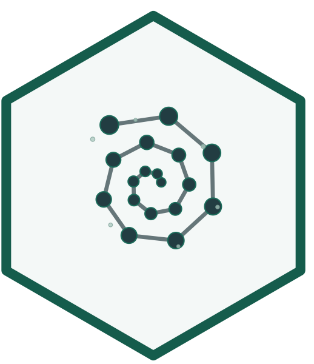

# emergenceModelR

[](https://www.r-project.org/)
[](LICENSE)
[](https://noushinn.github.io/emergenceModelR/)
<!-- badges: start -->
[](https://doi.org/10.5281/zenodo.20766770)
<!-- badges: end -->
[](https://github.com/NoushinN/emergenceModelR)

**emergenceModelR** is an educational R package for simulating, visualizing, and explaining simplified models of emergence, self-organization, complexity, cellular automata, agent interactions, and network growth.

The package combines R functions, core tutorials, and a detailed theory guide to help learners explore how system-level patterns can arise from local rules, interactions, feedback, and network structure.

## Overview

Emergence refers to situations in which higher-level patterns arise from interactions among lower-level components. These patterns are not usually imposed by a central controller. Instead, they develop through repeated local interactions.

`emergenceModelR` provides simplified simulations that make this idea visible. The package is designed for teaching, conceptual exploration, science communication, and academic portfolio development.

The central idea is:

> Complex system-level patterns can arise from simple local rules and interactions.

## Main features

The package provides educational toy simulations for:

- cellular automata and local update rules;
- self-organization on spatial grids;
- agent interactions and group-level movement;
- network growth and preferential attachment;
- information, entropy, and complexity-oriented metrics;
- visualization of emergence simulations;
- comparison of different emergence mechanisms.

## Important note

This package **does not fully model real biological, cognitive, social, ecological, neural, or conscious systems**.

The models are simplified educational abstractions. They are designed to help users understand concepts such as local rules, feedback, diffusion, agent interaction, network structure, entropy, and system-level pattern formation.

It is better to say:

> The simulations illustrate emergence-like patterns.

than:

> The simulations prove emergence in real systems.

## Installation

You can install the development version from GitHub:

```r
if (!requireNamespace("remotes", quietly = TRUE)) {
  install.packages("remotes")
}

remotes::install_github("NoushinN/emergenceModelR")
```

Then load the package:

```r
library(emergenceModelR)
```

## Quick example

This example simulates a simple cellular automaton using Rule 30.

```r
library(emergenceModelR)

ca <- simulate_cellular_automata(
  rule = 30,
  n_cells = 51,
  steps = 50
)

head(ca)
```

Visualize the pattern:

```r
plot_emergence_sim(
  ca,
  x = "cell",
  y = "step",
  value = "state",
  type = "raster"
)
```

Summarize the output:

```r
measure_emergence(
  ca,
  value_col = "state",
  time_col = "step"
)
```

## Package structure

The package website is organized into three main sections.

| Section | Purpose |
|---|---|
| **Reference** | Formal documentation for each R function |
| **Core Tutorials** | Step-by-step examples showing how to run, visualize, compare, and interpret simulations |
| **Theory Guide** | Deeper conceptual chapters explaining emergence, self-organization, complexity, information, networks, life, consciousness, and responsible use |

## Core functions

| Function | Purpose |
|---|---|
| `simulate_cellular_automata()` | Simulates simple local update rules that generate global patterns |
| `simulate_self_organization()` | Simulates local feedback, diffusion, and spatial pattern formation |
| `simulate_agent_interactions()` | Simulates local agent interactions and group-level dynamics |
| `simulate_network_growth()` | Simulates random or preferential network growth |
| `measure_emergence()` | Computes simple diversity, entropy, variability, and temporal-change summaries |
| `plot_emergence_sim()` | Visualizes simulation outputs |

## Core tutorials

The Core Tutorials provide practical, code-focused walkthroughs.

They show how to:

- run each simulation function;
- inspect the output structure;
- visualize model results;
- compare parameter settings;
- use `measure_emergence()`;
- interpret outputs carefully.

Tutorial topics include:

- Getting Started with `emergenceModelR`
- Cellular Automata Tutorial
- Self-Organization Tutorial
- Agent Interactions Tutorial
- Network Growth Tutorial
- Measuring Emergence Tutorial
- Comparing Emergence Models Tutorial

## Theory guide

The Theory Guide provides deeper conceptual background for the package.

It explains topics such as:

- what emergence means;
- weak and strong emergence;
- self-organization;
- complexity and information;
- cellular automata and local rules;
- agent-based emergence;
- networks and emergence;
- measuring emergence;
- emergence, life, and consciousness;
- limitations and responsible use.

The theory chapters are designed to connect the code examples to broader ideas in complexity science, artificial life, origin-of-life research, cognitive science, and philosophy of mind.

## Suggested use

This package may be useful for:

- teaching emergence and complexity;
- introducing computational modeling;
- demonstrating local-rule systems;
- comparing different emergence mechanisms;
- supporting discussions about life, cognition, and consciousness;
- building an academic or technical portfolio;
- creating examples for science communication.

## Responsible interpretation

The simulations in this package are toy models. Their purpose is conceptual clarity, not realism.

The package does not claim to:

- prove emergence in nature;
- simulate real biological life;
- model consciousness directly;
- measure true complexity in a final sense;
- replace empirical scientific models.

Instead, it helps users explore how local rules and interactions can generate system-level patterns.

## Documentation

The full package website is available here:

<https://noushinn.github.io/emergenceModelR/>

The source code is available here:

<https://github.com/NoushinN/emergenceModelR>

## Related projects

This package can complement related educational projects on origin of life, consciousness, artificial life, and complexity.

For example:

| Project theme | Relationship |
|---|---|
| Origin of life | Emergence helps explain how organized life-like systems may arise from interacting components |
| Consciousness theories | Emergence provides a framework for thinking about system-level cognitive organization |
| Complexity science | Emergence connects local rules, feedback, networks, and global patterns |
| Artificial life | Toy simulations help explore life-like organization in simplified systems |

## License

MIT License

## Citation

If referencing this project, please cite: 

Nabavi, N. *emergenceModelR: An Educational R Package for Simulating Simplified Models of Emergence and Complexity*.
[[DOI](https://doi.org/10.5281/zenodo.20766770)