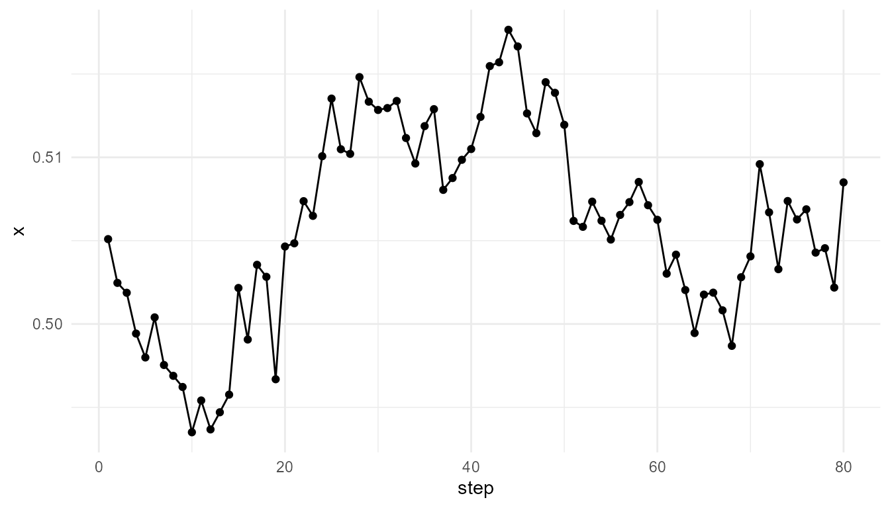
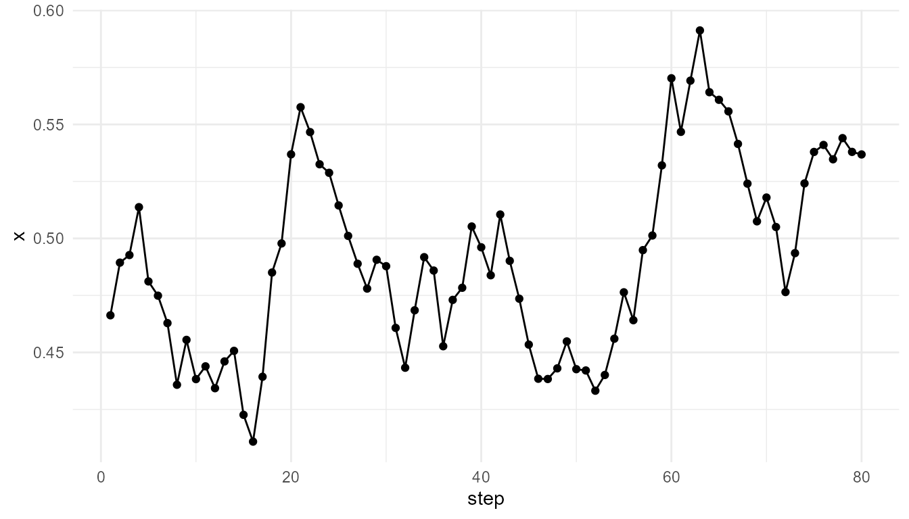

# Agent-Based Emergence

``` r
library(emergenceModelR)
```

## Purpose

This article explains agent-based emergence. Agent-based models show how
collective patterns can arise when individual agents follow local rules
and interact with one another over time (Epstein and Axtell 1996; Miller
and Page 2007).

The purpose of this chapter is to show how
[`simulate_agent_interactions()`](https://noushinn.github.io/emergenceModelR/reference/simulate_agent_interactions.md)
represents a basic form of bottom-up modeling. The function does not
attempt to model real organisms, societies, or neural systems in detail.
Instead, it provides a simplified teaching model for exploring how local
movement, interaction, alignment, and randomness can generate
group-level behavior.

The guiding question is:

> How can organized collective behavior arise from many individuals
> following simple local rules?

## What is an agent-based model?

An agent-based model represents a system as a collection of individual
units called **agents**. Each agent has properties, follows rules, and
interacts with other agents or with its environment.

The agents may represent many different kinds of units, depending on the
research question:

| System          | Possible agents                          |
|-----------------|------------------------------------------|
| Ecology         | organisms, species, populations          |
| Social systems  | people, households, organizations        |
| Economics       | consumers, firms, markets                |
| Biology         | cells, molecules, organisms              |
| Cognition       | neurons, modules, decision units         |
| Artificial life | simulated organisms or adaptive entities |

The central idea is that the system-level pattern is not imposed
directly. Instead, the pattern arises from the repeated actions and
interactions of individual agents.

## Bottom-up modeling

Agent-based models are often described as **bottom-up**. They begin with
individuals and local rules, then observe what happens at the system
level.

This is different from top-down modeling, where the system is often
described using aggregate equations or average behavior. A top-down
model might describe a population as a single variable. An agent-based
model represents many individual agents and allows population-level
behavior to emerge from their interactions.

This bottom-up approach is useful when:

- individuals differ from one another;
- local interactions matter;
- spatial structure matters;
- history and sequence matter;
- randomness affects outcomes;
- collective patterns are difficult to predict from averages alone.

For this reason, agent-based models are widely used in studies of social
dynamics, ecology, economics, epidemiology, artificial life, movement,
cooperation, and adaptation (Epstein and Axtell 1996; Miller and Page
2007).

## Local rules and collective outcomes

Agent-based emergence depends on the relationship between local rules
and collective outcomes.

An individual agent may follow a simple rule:

- move randomly;
- align slightly with nearby agents;
- avoid crowding;
- follow a resource gradient;
- copy a neighbor;
- cooperate or defect;
- reproduce or die.

When many agents follow such rules repeatedly, group-level structure may
appear. The collective pattern may include clustering, flocking,
dispersal, waves, segregation, cooperation, or coordinated movement.

The important point is that no agent needs to understand the whole
system. Collective behavior can arise even when each agent responds only
to local information.

## Local interaction

In
[`simulate_agent_interactions()`](https://noushinn.github.io/emergenceModelR/reference/simulate_agent_interactions.md),
agents move in a two-dimensional space. They are influenced by nearby
agents and by random movement. The model is deliberately simple, but it
demonstrates how local interaction can affect group-level behavior.

The core parameters include:

| Parameter            | Conceptual meaning                                 |
|----------------------|----------------------------------------------------|
| `n_agents`           | Number of agents in the system                     |
| `steps`              | Number of time steps                               |
| `interaction_radius` | Distance within which agents influence one another |
| `alignment`          | Strength of movement alignment with nearby agents  |
| `seed`               | Random seed for reproducibility                    |

The function therefore represents a simplified interaction system:
agents move, respond to nearby agents, and collectively generate
trajectories over time.

## Basic simulation

``` r
agents <- simulate_agent_interactions(
  n_agents = 50,
  steps = 80,
  interaction_radius = 0.15,
  alignment = 0.05,
  seed = 8
)

head(agents)
#>   step agent         x          y
#> 1    1    A1 0.4662952 0.13410932
#> 2    1    A2 0.2078233 0.06713086
#> 3    1    A3 0.7996580 0.14446098
#> 4    1    A4 0.6518713 0.34520790
#> 5    1    A5 0.3215092 0.97448107
#> 6    1    A6 0.7189275 0.28083113
```

## Tracking the group center

One simple way to summarize collective movement is to calculate the
average position of the group at each time step.

``` r
center <- aggregate(
  cbind(x, y) ~ step,
  data = agents,
  FUN = mean
)

head(center)
#>   step         x         y
#> 1    1 0.5050932 0.4902347
#> 2    2 0.5024663 0.4885721
#> 3    3 0.5018733 0.4904309
#> 4    4 0.4994247 0.4875765
#> 5    5 0.4979910 0.4850244
#> 6    6 0.5003963 0.4809147
```

``` r
plot_emergence_sim(
  center,
  x = "step",
  y = "x",
  type = "line"
)
```



## Interpretation

The group center changes over time because agents are moving and
interacting. No single agent controls the group. The group-level
trajectory is a summary of many individual movements.

This illustrates the core logic of agent-based emergence:

> Collective behavior arises from repeated local actions, not from a
> central controller.

The model is simple, but it helps learners understand why collective
dynamics cannot always be inferred from the behavior of a single agent
alone.

## Interaction radius

The `interaction_radius` parameter controls how far agents can “notice”
or be influenced by nearby agents. A small radius means that agents
respond only to very close neighbors. A larger radius means that more
agents can influence one another.

``` r
small_radius <- simulate_agent_interactions(
  n_agents = 50,
  steps = 80,
  interaction_radius = 0.05,
  alignment = 0.05,
  seed = 8
)

large_radius <- simulate_agent_interactions(
  n_agents = 50,
  steps = 80,
  interaction_radius = 0.30,
  alignment = 0.05,
  seed = 8
)

small_center <- aggregate(cbind(x, y) ~ step, data = small_radius, FUN = mean)
large_center <- aggregate(cbind(x, y) ~ step, data = large_radius, FUN = mean)

head(small_center)
#>   step         x         y
#> 1    1 0.5050932 0.4902347
#> 2    2 0.5024473 0.4885756
#> 3    3 0.5018415 0.4901996
#> 4    4 0.4992804 0.4871061
#> 5    5 0.4979719 0.4844932
#> 6    6 0.5004923 0.4803796
head(large_center)
#>   step         x         y
#> 1    1 0.5050932 0.4902347
#> 2    2 0.5023614 0.4885420
#> 3    3 0.5018155 0.4905072
#> 4    4 0.4994076 0.4872856
#> 5    5 0.4977665 0.4848004
#> 6    6 0.4998124 0.4806412
```

## Interpretation of interaction radius

Interaction radius matters because it defines the local neighborhood of
each agent. If the radius is small, the system may behave as many weakly
connected local groups. If the radius is large, agents are more likely
to influence one another across broader distances.

This is an important principle in emergence:

> The scale of interaction shapes the scale of collective behavior.

In real systems, interaction distance can correspond to physical
distance, communication range, social connection, chemical signaling, or
perceptual range.

## Alignment

The `alignment` parameter controls how strongly agents adjust their
movement in response to nearby agents. Alignment is important in many
collective systems, especially flocking, schooling, crowd movement, and
coordination.

``` r
weak_alignment <- simulate_agent_interactions(
  n_agents = 50,
  steps = 80,
  interaction_radius = 0.15,
  alignment = 0.01,
  seed = 8
)

strong_alignment <- simulate_agent_interactions(
  n_agents = 50,
  steps = 80,
  interaction_radius = 0.15,
  alignment = 0.15,
  seed = 8
)

weak_center <- aggregate(cbind(x, y) ~ step, data = weak_alignment, FUN = mean)
strong_center <- aggregate(cbind(x, y) ~ step, data = strong_alignment, FUN = mean)

head(weak_center)
#>   step         x         y
#> 1    1 0.5050932 0.4902347
#> 2    2 0.5024511 0.4885749
#> 3    3 0.5018317 0.4902347
#> 4    4 0.4992718 0.4872055
#> 5    5 0.4979703 0.4846036
#> 6    6 0.5004689 0.4804981
head(strong_center)
#>   step         x         y
#> 1    1 0.5050932 0.4902347
#> 2    2 0.5025044 0.4885651
#> 3    3 0.5018100 0.4907644
#> 4    4 0.4995416 0.4878295
#> 5    5 0.4978822 0.4855707
#> 6    6 0.4998590 0.4812056
```

## Interpretation of alignment

Weak alignment means that agents remain more independent. Strong
alignment means that local neighbors exert greater influence on one
another’s movement.

Alignment can produce coordination, but too much alignment may also
reduce diversity of behavior. This tension is common in emergent
systems. Collective order often depends on a balance between individual
variation and social or local influence.

## Individual behavior versus collective pattern

A key advantage of agent-based modeling is that it allows both
individual and collective levels to be examined.

At the individual level, each agent has a position and movement history.
At the collective level, the group may show clustering, dispersion, or
coordinated movement.

``` r
one_agent <- subset(agents, agent == unique(agents$agent)[1])

head(one_agent)
#>     step agent         x         y
#> 1      1    A1 0.4662952 0.1341093
#> 51     2    A1 0.4893902 0.1327761
#> 101    3    A1 0.4927187 0.1278746
#> 151    4    A1 0.5137206 0.1246703
#> 201    5    A1 0.4811531 0.1090003
#> 251    6    A1 0.4749002 0.1414944
```

``` r
plot_emergence_sim(
  one_agent,
  x = "step",
  y = "x",
  type = "line"
)
```



A single agent’s trajectory may appear noisy or limited. The collective
pattern becomes clearer only when many agents are considered together.

This is a defining feature of emergence: the system-level description is
not simply a copy of the individual-level description.

## Measuring collective behavior

The function
[`measure_emergence()`](https://noushinn.github.io/emergenceModelR/reference/measure_emergence.md)
can be used to summarize simulation outputs. Metrics do not fully define
emergence, but they can help compare model runs.

``` r
center <- aggregate(
  cbind(x, y) ~ step,
  data = agents,
  FUN = mean
)

measure_emergence(
  center,
  value_col = "x",
  time_col = "step"
)
#>    n unique_states shannon_entropy mean_value    sd_value temporal_variability
#> 1 80            80        6.321928  0.5059994 0.005936455          0.005936455
#>   mean_absolute_change
#> 1          0.002154234
```

Such summaries are useful for comparing parameter settings. For example,
one can compare whether high alignment produces less variability than
low alignment, or whether larger interaction radii produce more
coordinated movement.

## Agent-based emergence and self-organization

Agent-based emergence is closely related to self-organization. In both
cases, system-level order arises without central control.

However, agent-based models emphasize individual entities. Each agent
can have its own state, behavior, and interaction rules. This makes
agent-based modeling especially useful for systems where heterogeneity
matters.

Self-organization asks how order forms through internal dynamics.
Agent-based modeling asks how individual actions and interactions
produce collective outcomes.

## Connection to life

Agent-based emergence is relevant to origin-of-life and biological
themes because living systems involve many interacting units across
levels.

Examples include:

- molecules forming reaction networks;
- protocells interacting with environments;
- cells coordinating in tissues;
- organisms interacting in ecosystems;
- populations evolving through variation and selection.

In each case, system-level organization arises from interactions among
lower-level units. This does not mean that agent-based models fully
explain life, but they provide a useful way to represent local
interaction, adaptation, and collective dynamics.

## Connection to cognition and consciousness

Agent-based emergence is also relevant to cognition and consciousness.
Brains are not controlled by a single central unit in a simple sense.
Cognitive patterns arise from interactions among many neurons, neural
populations, bodily systems, and environmental feedback.

Similarly, social cognition and collective intelligence can involve many
interacting agents producing group-level behavior that no single
individual fully controls.

This does not mean that agent-based models explain consciousness.
Rather, they provide a modeling language for thinking about how
distributed interactions can give rise to organized behavior.

## Relation to other package functions

| Function | Relationship to agent-based emergence |
|----|----|
| [`simulate_agent_interactions()`](https://noushinn.github.io/emergenceModelR/reference/simulate_agent_interactions.md) | Models local interaction among moving agents |
| [`simulate_self_organization()`](https://noushinn.github.io/emergenceModelR/reference/simulate_self_organization.md) | Models distributed pattern formation on a grid |
| [`simulate_network_growth()`](https://noushinn.github.io/emergenceModelR/reference/simulate_network_growth.md) | Models relational structure among connected units |
| [`measure_emergence()`](https://noushinn.github.io/emergenceModelR/reference/measure_emergence.md) | Summarizes diversity, entropy, or temporal change |
| [`plot_emergence_sim()`](https://noushinn.github.io/emergenceModelR/reference/plot_emergence_sim.md) | Visualizes individual or collective dynamics |

Together, these functions help learners compare different pathways to
emergence: spatial patterns, agent interactions, and network structure.

## What the model captures

The model captures several important ideas:

- individual agents follow local rules;
- agents respond to nearby agents;
- collective behavior can arise without central control;
- interaction radius affects coordination;
- alignment affects group movement;
- randomness and local influence interact over time.

These features make the model useful for teaching the bottom-up logic of
agent-based emergence.

## What the model does not capture

The model is intentionally simplified. It does not include:

- real perception;
- memory;
- learning;
- reproduction;
- energy use;
- decision-making;
- communication in detail;
- environmental resources;
- evolutionary adaptation;
- complex social behavior.

It is a teaching model, not a complete behavioral, ecological,
biological, or cognitive model.

## Responsible interpretation

It is better to say:

> The simulation illustrates how collective movement can arise from
> local agent interactions.

than:

> The simulation explains real animal behavior or social coordination.

It is better to say:

> The model shows how interaction radius and alignment affect
> group-level patterns.

than:

> The model fully represents cognition, life, or society.

Careful interpretation is especially important because agent-based
models can appear realistic even when their rules are highly simplified.

## Educational use

This chapter can support several classroom or self-study questions:

- How does local interaction produce group-level behavior?
- What happens when agents have a larger interaction radius?
- What happens when alignment is stronger?
- Does collective order require central control?
- How does randomness affect group behavior?
- What is lost when real agents are simplified?
- How could the model be extended to include memory, learning, or
  resources?

These questions help learners understand agent-based models as tools for
conceptual exploration rather than complete representations of real
systems.

## Key takeaway

Agent-based emergence occurs when collective patterns arise from the
repeated actions and interactions of individual agents.

[`simulate_agent_interactions()`](https://noushinn.github.io/emergenceModelR/reference/simulate_agent_interactions.md)
provides a simplified educational model of this process. It helps
learners explore how local interaction, movement, alignment, and
randomness can generate group-level dynamics without central control.

## References

Epstein, Joshua M., and Robert Axtell. 1996. *Growing Artificial
Societies: Social Science from the Bottom up*. Brookings Institution
Press.

Miller, John H., and Scott E. Page. 2007. *Complex Adaptive Systems: An
Introduction to Computational Models of Social Life*. Princeton
University Press.
