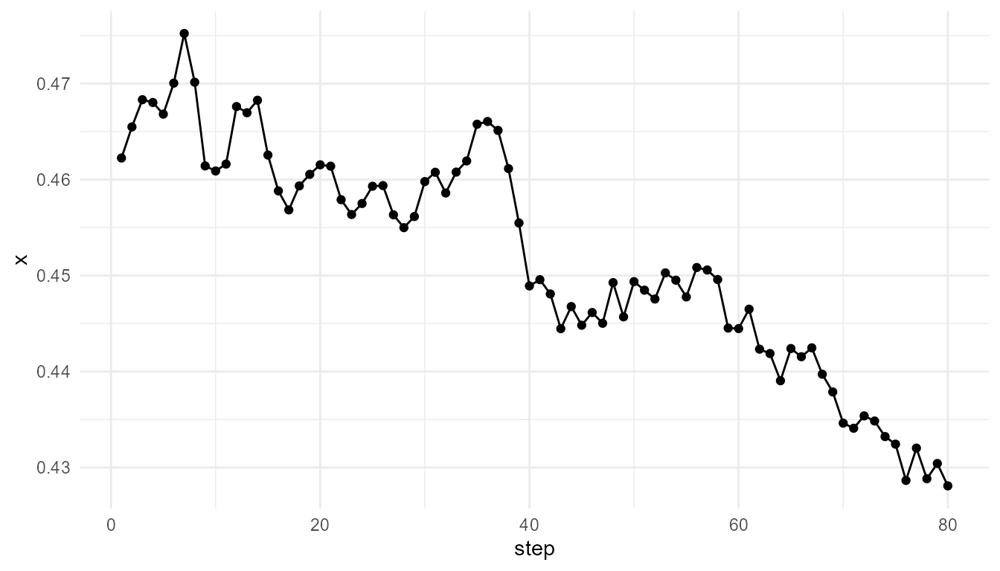
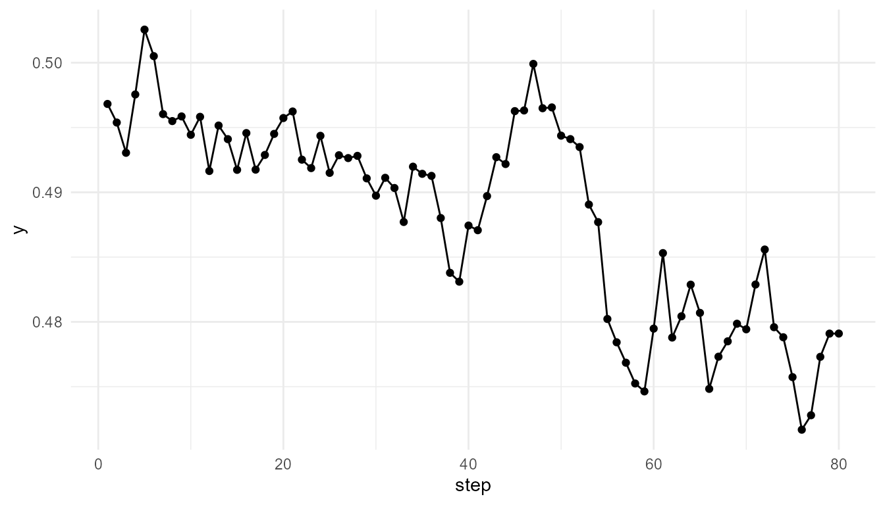
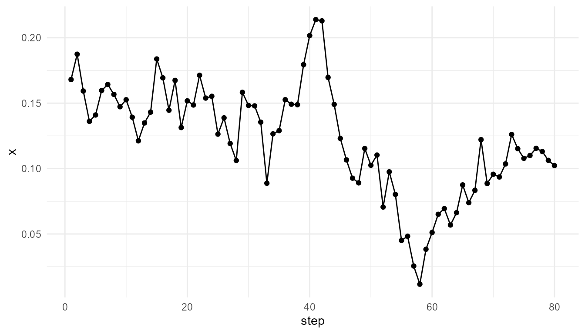
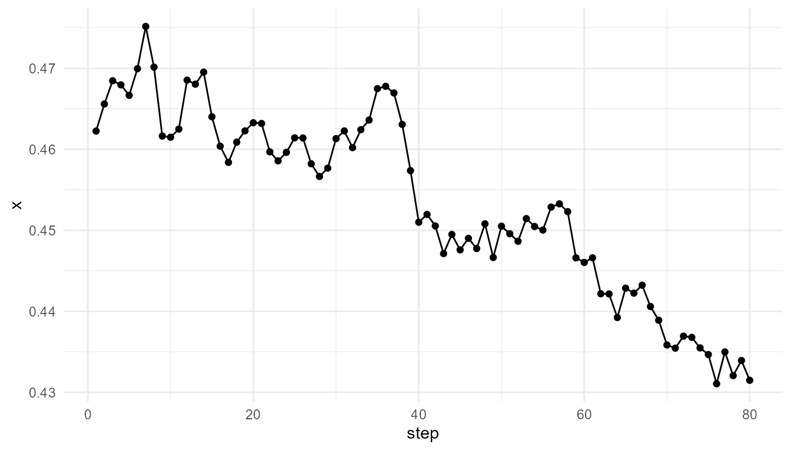
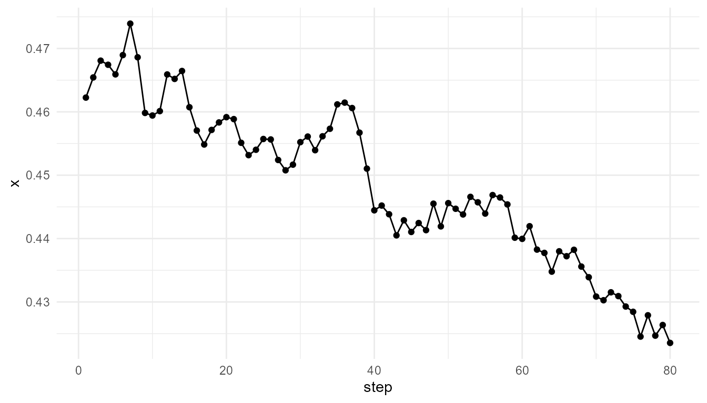
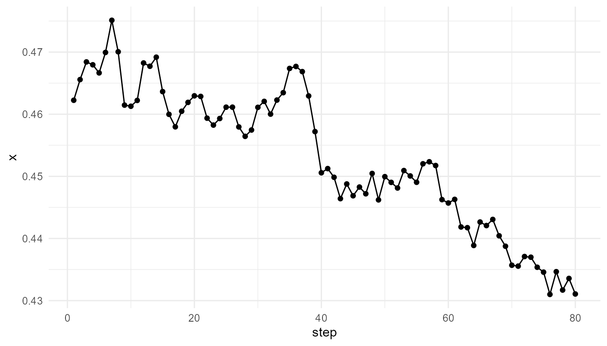
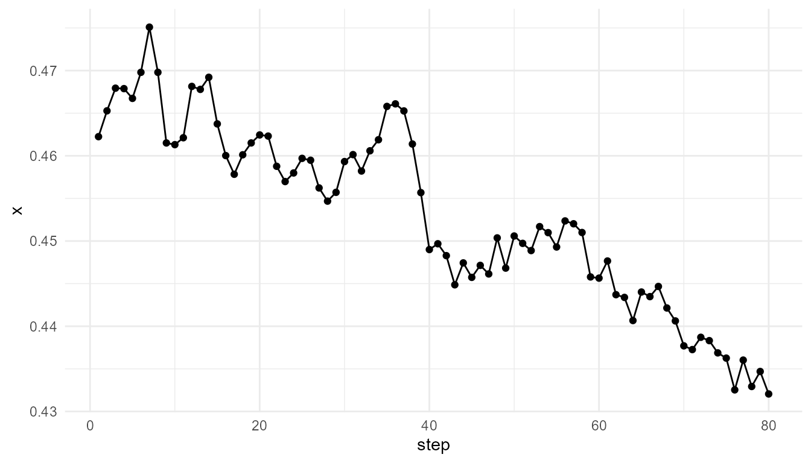
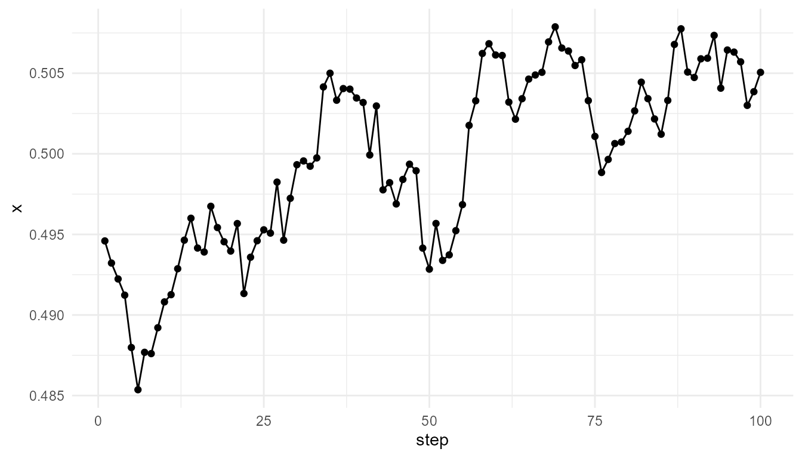

# Agent Interactions Tutorial

``` r
library(emergenceModelR)
```

## Purpose

This tutorial introduces
[`simulate_agent_interactions()`](https://noushinn.github.io/emergenceModelR/reference/simulate_agent_interactions.md).
The function creates a simplified agent-based model showing how local
interactions among agents can produce group-level patterns.

In this tutorial, you will learn how to:

- run a basic agent interaction simulation;
- inspect the output;
- summarize group movement;
- compare interaction radius settings;
- compare alignment settings;
- use
  [`measure_emergence()`](https://noushinn.github.io/emergenceModelR/reference/measure_emergence.md)
  to summarize outputs;
- interpret agent-based emergence responsibly.

## What the function represents

An agent-based model represents a system as a collection of individual
agents. Each agent follows simple rules and interacts with nearby agents
or with its environment.

In
[`simulate_agent_interactions()`](https://noushinn.github.io/emergenceModelR/reference/simulate_agent_interactions.md),
agents move in a two-dimensional space. Their movement is influenced by
local interaction and random variation.

The model is intentionally simple. It does not represent real animal
behavior, social behavior, cognition, or ecological dynamics in detail.
Its purpose is to illustrate one core idea:

> Collective behavior can arise from repeated local interactions among
> individual agents.

## Main arguments

| Argument | Meaning |
|----|----|
| `n_agents` | Number of agents in the simulation |
| `steps` | Number of time steps |
| `interaction_radius` | Distance within which agents can influence one another |
| `alignment` | Strength of movement alignment with nearby agents |
| `seed` | Random seed for reproducible results |

The two most important parameters are `interaction_radius` and
`alignment`.

`interaction_radius` controls how far agents can influence each other.  
`alignment` controls how strongly agents adjust movement in response to
nearby agents.

## Basic simulation

Start with a simple simulation.

``` r
agents <- simulate_agent_interactions(
  n_agents = 40,
  steps = 80,
  interaction_radius = 0.15,
  alignment = 0.05,
  seed = 3
)

head(agents)
#>   step agent         x         y
#> 1    1    A1 0.1680415 0.2814688
#> 2    1    A2 0.8075164 0.7862812
#> 3    1    A3 0.3849424 0.1730193
#> 4    1    A4 0.3277343 0.5707475
#> 5    1    A5 0.6021007 0.4192830
#> 6    1    A6 0.6043941 0.2676222
```

## Inspect the output

The output is a data frame. Each row represents one agent at one time
step.

``` r
str(agents)
#> 'data.frame':    3200 obs. of  4 variables:
#>  $ step : int  1 1 1 1 1 1 1 1 1 1 ...
#>  $ agent: chr  "A1" "A2" "A3" "A4" ...
#>  $ x    : num  0.168 0.808 0.385 0.328 0.602 ...
#>  $ y    : num  0.281 0.786 0.173 0.571 0.419 ...
```

The main columns usually include:

| Column  | Meaning             |
|---------|---------------------|
| `step`  | Time step           |
| `agent` | Agent identifier    |
| `x`     | Horizontal position |
| `y`     | Vertical position   |

This structure allows you to examine individual movement or summarize
group-level behavior.

## Summarize the group center

One simple way to summarize collective movement is to calculate the
average position of all agents at each time step.

``` r
center <- aggregate(
  cbind(x, y) ~ step,
  data = agents,
  FUN = mean
)

head(center)
#>   step         x         y
#> 1    1 0.4622470 0.4968189
#> 2    2 0.4654902 0.4953847
#> 3    3 0.4683242 0.4930494
#> 4    4 0.4680317 0.4975510
#> 5    5 0.4668201 0.5025552
#> 6    6 0.4700478 0.5005083
```

## Plot group movement

Plot the average `x` position over time.

``` r
plot_emergence_sim(
  center,
  x = "step",
  y = "x",
  type = "line"
)
```



Plot the average `y` position over time.

``` r
plot_emergence_sim(
  center,
  x = "step",
  y = "y",
  type = "line"
)
```



## Interpretation

The group center changes over time because individual agents are moving
and interacting. No single agent controls the group-level trajectory.

This illustrates the basic logic of agent-based emergence:

> Group-level patterns can arise from many individual agents following
> local rules.

The group center is only one summary. It does not capture every detail
of agent behavior, but it provides a useful starting point.

## Examine one agent

You can also inspect the movement of a single agent.

``` r
one_agent <- subset(
  agents,
  agent == unique(agents$agent)[1]
)

head(one_agent)
#>     step agent         x         y
#> 1      1    A1 0.1680415 0.2814688
#> 41     2    A1 0.1874116 0.2722931
#> 81     3    A1 0.1592726 0.2767441
#> 121    4    A1 0.1361010 0.2844139
#> 161    5    A1 0.1409437 0.2818173
#> 201    6    A1 0.1597038 0.2941417
```

``` r
plot_emergence_sim(
  one_agent,
  x = "step",
  y = "x",
  type = "line"
)
```



## Interpretation of individual movement

A single agent’s trajectory may look different from the group-level
summary. This is important because agent-based models allow you to
examine both levels:

- individual behavior;
- collective pattern.

Emergence appears when the group-level pattern cannot be understood
simply by looking at one agent in isolation.

## Compare interaction radius

The `interaction_radius` parameter controls the distance within which
agents can influence one another.

A small radius means agents respond only to very close neighbors.  
A larger radius means agents can be influenced by more nearby agents.

``` r
small_radius <- simulate_agent_interactions(
  n_agents = 40,
  steps = 80,
  interaction_radius = 0.05,
  alignment = 0.05,
  seed = 3
)

large_radius <- simulate_agent_interactions(
  n_agents = 40,
  steps = 80,
  interaction_radius = 0.30,
  alignment = 0.05,
  seed = 3
)
```

## Summarize radius comparison

``` r
rbind(
  small_radius = measure_emergence(
    small_radius,
    value_col = "x",
    time_col = "step"
  ),
  large_radius = measure_emergence(
    large_radius,
    value_col = "x",
    time_col = "step"
  )
)
#>                 n unique_states shannon_entropy mean_value  sd_value
#> small_radius 3200          3160        11.58567  0.4534502 0.2619113
#> large_radius 3200          3200        11.64386  0.4485507 0.1607586
#>              temporal_variability mean_absolute_change
#> small_radius           0.01139415          0.002271893
#> large_radius           0.01253964          0.002309593
```

## Plot radius comparison using group centers

``` r
small_center <- aggregate(
  cbind(x, y) ~ step,
  data = small_radius,
  FUN = mean
)

large_center <- aggregate(
  cbind(x, y) ~ step,
  data = large_radius,
  FUN = mean
)

head(small_center)
#>   step         x         y
#> 1    1 0.4622470 0.4968189
#> 2    2 0.4655900 0.4954483
#> 3    3 0.4684588 0.4933867
#> 4    4 0.4679535 0.4979719
#> 5    5 0.4666542 0.5028595
#> 6    6 0.4699501 0.5008574
head(large_center)
#>   step         x         y
#> 1    1 0.4622470 0.4968189
#> 2    2 0.4654295 0.4957186
#> 3    3 0.4680780 0.4933566
#> 4    4 0.4674288 0.4980353
#> 5    5 0.4659111 0.5032384
#> 6    6 0.4689537 0.5015246
```

``` r
plot_emergence_sim(
  small_center,
  x = "step",
  y = "x",
  type = "line"
)
```



``` r
plot_emergence_sim(
  large_center,
  x = "step",
  y = "x",
  type = "line"
)
```



## Interpretation of interaction radius

Interaction radius changes the scale of local influence. When the radius
is small, agents interact with fewer neighbors. When the radius is
larger, agents can be influenced by a broader local neighborhood.

This illustrates an important principle:

> The scale of local interaction can shape the scale of collective
> behavior.

The metrics help summarize the difference, but the plots are also
important.

## Compare alignment settings

The `alignment` parameter controls how strongly agents adjust movement
based on nearby agents.

A low alignment setting means agents remain more independent.  
A higher alignment setting means nearby agents influence one another
more strongly.

``` r
weak_alignment <- simulate_agent_interactions(
  n_agents = 40,
  steps = 80,
  interaction_radius = 0.15,
  alignment = 0.01,
  seed = 3
)

strong_alignment <- simulate_agent_interactions(
  n_agents = 40,
  steps = 80,
  interaction_radius = 0.15,
  alignment = 0.15,
  seed = 3
)
```

## Summarize alignment comparison

``` r
rbind(
  weak_alignment = measure_emergence(
    weak_alignment,
    value_col = "x",
    time_col = "step"
  ),
  strong_alignment = measure_emergence(
    strong_alignment,
    value_col = "x",
    time_col = "step"
  )
)
#>                     n unique_states shannon_entropy mean_value  sd_value
#> weak_alignment   3200          3169        11.60181  0.4531485 0.2600777
#> strong_alignment 3200          3199        11.64323  0.4530487 0.2274567
#>                  temporal_variability mean_absolute_change
#> weak_alignment             0.01142722          0.002273111
#> strong_alignment           0.01069154          0.002274397
```

## Plot alignment comparison using group centers

``` r
weak_center <- aggregate(
  cbind(x, y) ~ step,
  data = weak_alignment,
  FUN = mean
)

strong_center <- aggregate(
  cbind(x, y) ~ step,
  data = strong_alignment,
  FUN = mean
)

head(weak_center)
#>   step         x         y
#> 1    1 0.4622470 0.4968189
#> 2    2 0.4655754 0.4954598
#> 3    3 0.4684177 0.4933503
#> 4    4 0.4679551 0.4979165
#> 5    5 0.4666512 0.5027972
#> 6    6 0.4699421 0.5007755
head(strong_center)
#>   step         x         y
#> 1    1 0.4622470 0.4968189
#> 2    2 0.4652774 0.4951969
#> 3    3 0.4679357 0.4924120
#> 4    4 0.4678824 0.4965541
#> 5    5 0.4667372 0.5017519
#> 6    6 0.4697937 0.4994990
```

``` r
plot_emergence_sim(
  weak_center,
  x = "step",
  y = "x",
  type = "line"
)
```



``` r
plot_emergence_sim(
  strong_center,
  x = "step",
  y = "x",
  type = "line"
)
```



## Interpretation of alignment

Alignment affects how strongly agents coordinate with nearby agents.
Stronger alignment may produce more coordinated group movement,
depending on the other parameters.

However, stronger alignment does not automatically mean “more
emergence.” It only means the local interaction rule has changed. The
result must be interpreted using both the plots and the metrics.

## Compare all runs

It can be useful to summarize all runs in one table.

``` r
summary_table <- rbind(
  baseline = measure_emergence(
    agents,
    value_col = "x",
    time_col = "step"
  ),
  small_radius = measure_emergence(
    small_radius,
    value_col = "x",
    time_col = "step"
  ),
  large_radius = measure_emergence(
    large_radius,
    value_col = "x",
    time_col = "step"
  ),
  weak_alignment = measure_emergence(
    weak_alignment,
    value_col = "x",
    time_col = "step"
  ),
  strong_alignment = measure_emergence(
    strong_alignment,
    value_col = "x",
    time_col = "step"
  )
)

summary_table
#>                     n unique_states shannon_entropy mean_value  sd_value
#> baseline         3200          3196        11.64073  0.4519456 0.2482445
#> small_radius     3200          3160        11.58567  0.4534502 0.2619113
#> large_radius     3200          3200        11.64386  0.4485507 0.1607586
#> weak_alignment   3200          3169        11.60181  0.4531485 0.2600777
#> strong_alignment 3200          3199        11.64323  0.4530487 0.2274567
#>                  temporal_variability mean_absolute_change
#> baseline                   0.01175780          0.002304347
#> small_radius               0.01139415          0.002271893
#> large_radius               0.01253964          0.002309593
#> weak_alignment             0.01142722          0.002273111
#> strong_alignment           0.01069154          0.002274397
```

## Interpretation of metrics

The metrics summarize variation and change in the selected variable,
here the `x` position.

This is useful, but it is incomplete. Agent-based behavior may also
involve:

- changes in `y` position;
- distance among agents;
- clustering;
- group spread;
- alignment of movement;
- individual variation;
- collective direction.

Therefore, metrics should be interpreted as summaries, not complete
explanations.

## Suggested exercises

Try modifying the model settings.

``` r
experiment <- simulate_agent_interactions(
  n_agents = 80,
  steps = 100,
  interaction_radius = 0.20,
  alignment = 0.10,
  seed = 12
)

experiment_center <- aggregate(
  cbind(x, y) ~ step,
  data = experiment,
  FUN = mean
)

plot_emergence_sim(
  experiment_center,
  x = "step",
  y = "x",
  type = "line"
)
```



Questions to consider:

- What happens when `n_agents` increases?
- What happens when `interaction_radius` is very small?
- What happens when `interaction_radius` is large?
- What happens when `alignment` is close to zero?
- What happens when `alignment` is stronger?
- Do the metrics match what you see in the plots?
- What does the group center miss?

## Responsible interpretation

This model is a simplified educational model of agent interaction. It
should not be interpreted as a full model of real organisms, social
systems, cognition, or collective intelligence.

It is better to say:

> The simulation illustrates how local interactions can produce
> group-level patterns.

than:

> The simulation fully explains animal movement or social behavior.

It is better to say:

> The model shows how interaction radius and alignment affect simulated
> group movement.

than:

> The model proves how real collective behavior works.

## Key takeaway

[`simulate_agent_interactions()`](https://noushinn.github.io/emergenceModelR/reference/simulate_agent_interactions.md)
helps users explore how individual agents following local rules can
produce group-level dynamics.

The most important lesson is that no central controller is required.
Collective patterns can arise through repeated local interactions,
movement, alignment, and randomness.
