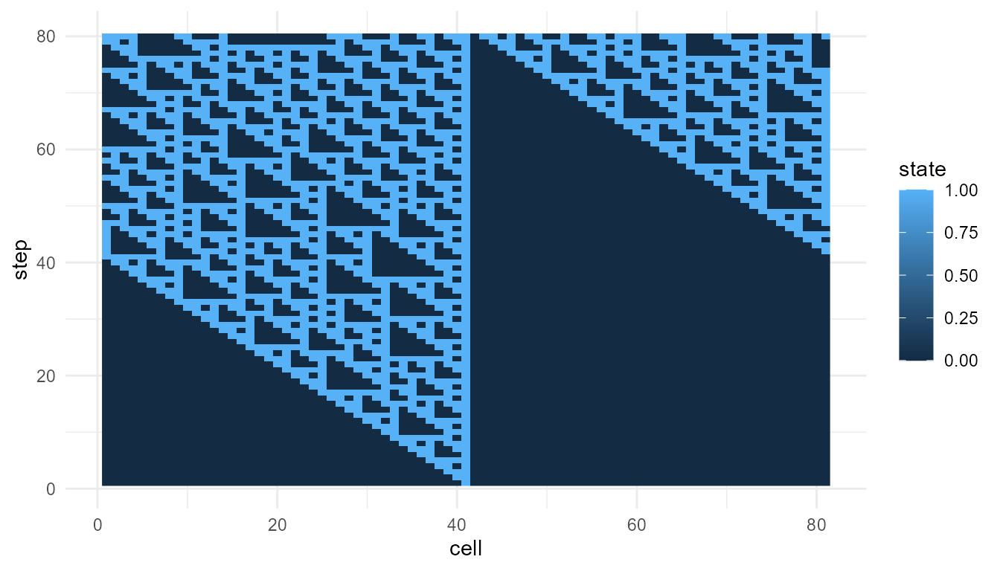
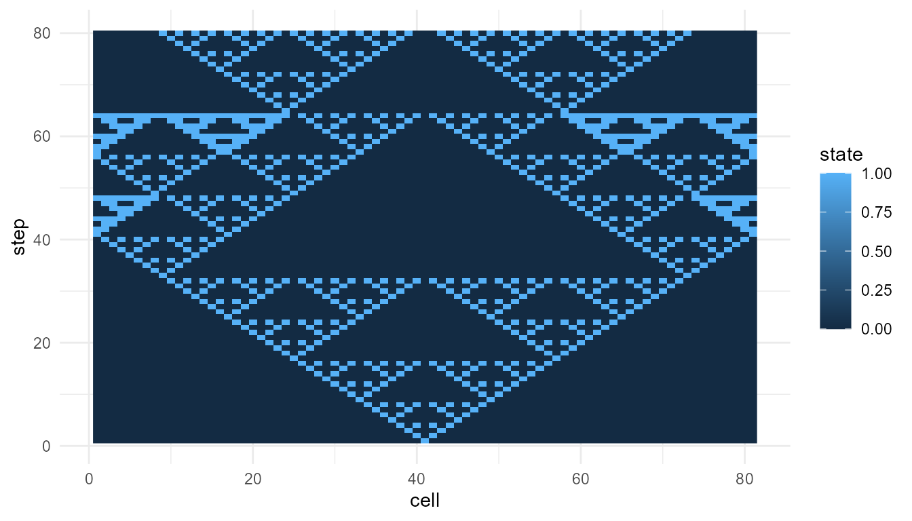
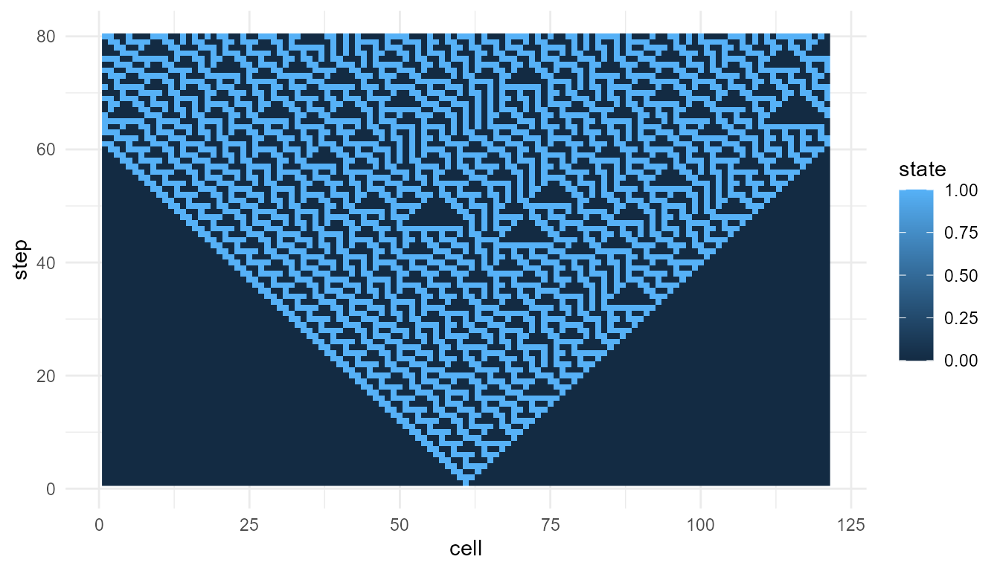
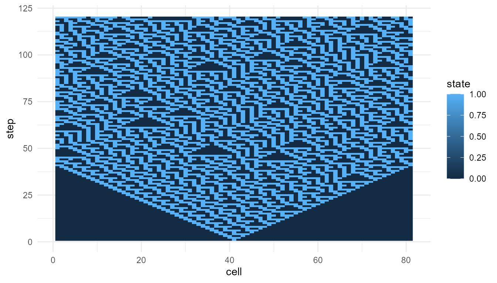
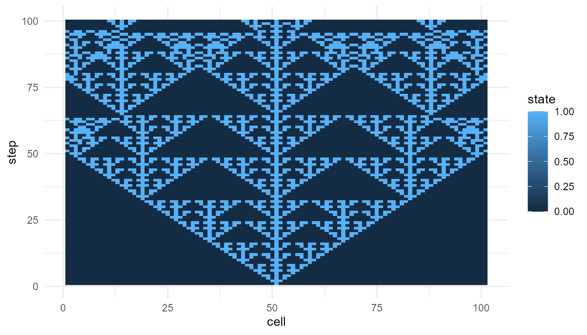

# Cellular Automata Tutorial

``` r
library(emergenceModelR)
```

## Purpose

This tutorial introduces
[`simulate_cellular_automata()`](https://noushinn.github.io/emergenceModelR/reference/simulate_cellular_automata.md).
Cellular automata are useful because they show how simple local rules
can produce unexpectedly rich global patterns.

In this tutorial, you will learn how to:

- run a basic cellular automaton;
- inspect the output;
- visualize cellular automata patterns;
- compare Rule 30 and Rule 110;
- summarize outputs using
  [`measure_emergence()`](https://noushinn.github.io/emergenceModelR/reference/measure_emergence.md);
- interpret cellular automata as simplified models of emergence.

## What the function represents

A cellular automaton is a grid of cells that update over time according
to a rule.

In an elementary cellular automaton:

- cells are arranged in one dimension;
- each cell has a binary state, usually `0` or `1`;
- each cell updates based on itself and its nearby neighbors;
- the same rule is applied repeatedly across the system.

The function
[`simulate_cellular_automata()`](https://noushinn.github.io/emergenceModelR/reference/simulate_cellular_automata.md)
creates this kind of simplified model.

The main idea is:

> Local update rules can generate global space-time patterns.

## Main arguments

| Argument  | Meaning                            |
|-----------|------------------------------------|
| `rule`    | The cellular automaton rule number |
| `n_cells` | Number of cells in the row         |
| `steps`   | Number of time steps to simulate   |

The `rule` argument is especially important. Different rules can produce
very different global patterns, even when the number of cells and steps
stays the same.

## Basic simulation: Rule 30

Rule 30 is often used to show how a simple deterministic rule can
produce irregular-looking patterns.

``` r
rule30 <- simulate_cellular_automata(
  rule = 30,
  n_cells = 81,
  steps = 80
)

head(rule30)
#>   step cell state
#> 1    1    1     0
#> 2    1    2     0
#> 3    1    3     0
#> 4    1    4     0
#> 5    1    5     0
#> 6    1    6     0
```

## Inspect the output

The output is a data frame.

``` r
str(rule30)
#> 'data.frame':    6480 obs. of  3 variables:
#>  $ step : int  1 1 1 1 1 1 1 1 1 1 ...
#>  $ cell : int  1 2 3 4 5 6 7 8 9 10 ...
#>  $ state: int  0 0 0 0 0 0 0 0 0 0 ...
```

The main columns usually include:

| Column  | Meaning                        |
|---------|--------------------------------|
| `step`  | Time step                      |
| `cell`  | Cell position                  |
| `state` | Cell state, usually `0` or `1` |

This structure makes it easy to visualize the pattern across cells and
time.

## Plot Rule 30

``` r
plot_emergence_sim(
  rule30,
  x = "cell",
  y = "step",
  value = "state",
  type = "raster"
)
```


## Interpretation of Rule 30

The pattern is generated by repeatedly applying a local rule. No cell
knows the global pattern. No central controller designs the structure.

This illustrates a core idea of emergence:

> A simple local rule can generate a complex system-level pattern.

Rule 30 is useful for teaching because the output can look surprisingly
irregular even though the rule is deterministic.

## Rule 110

Rule 110 is another important cellular automaton rule. It is often
discussed because it can produce structured patterns associated with
computation-like behavior.

``` r
rule110 <- simulate_cellular_automata(
  rule = 110,
  n_cells = 81,
  steps = 80
)

head(rule110)
#>   step cell state
#> 1    1    1     0
#> 2    1    2     0
#> 3    1    3     0
#> 4    1    4     0
#> 5    1    5     0
#> 6    1    6     0
```

``` r
plot_emergence_sim(
  rule110,
  x = "cell",
  y = "step",
  value = "state",
  type = "raster"
)
```



## Interpretation of Rule 110

Rule 110 often produces more visibly structured patterns than Rule 30.
These structures may persist, move, or interact across time.

The important teaching point is not that Rule 110 is alive or conscious.
Rather, it shows that very simple rule-based systems can generate
patterns with rich dynamics.

## Compare metrics

The function
[`measure_emergence()`](https://noushinn.github.io/emergenceModelR/reference/measure_emergence.md)
provides simple emergence-oriented summaries.

``` r
rbind(
  rule30 = measure_emergence(
    rule30,
    value_col = "state",
    time_col = "step"
  ),
  rule110 = measure_emergence(
    rule110,
    value_col = "state",
    time_col = "step"
  )
)
#>            n unique_states shannon_entropy mean_value  sd_value
#> rule30  6480             2       0.9612044  0.3845679 0.4865305
#> rule110 6480             2       0.8660753  0.2879630 0.4528487
#>         temporal_variability mean_absolute_change
#> rule30             0.1640558           0.07110486
#> rule110            0.1618021           0.03469292
```

## Interpreting the metrics

The metrics summarize selected features of the cellular automata
outputs, such as diversity, variability, or temporal change.

They are useful for comparison, but they should not be treated as a
complete measure of emergence.

A careful interpretation is:

> The metrics help compare patterns produced by different rules.

An overstatement would be:

> The metrics prove that one rule is truly more emergent.

The first statement is appropriate. The second is too strong.

## Compare another rule

Try Rule 90, which often produces a more regular nested pattern.

``` r
rule90 <- simulate_cellular_automata(
  rule = 90,
  n_cells = 81,
  steps = 80
)

plot_emergence_sim(
  rule90,
  x = "cell",
  y = "step",
  value = "state",
  type = "raster"
)
```



## Compare three rules

``` r
rbind(
  rule30 = measure_emergence(
    rule30,
    value_col = "state",
    time_col = "step"
  ),
  rule90 = measure_emergence(
    rule90,
    value_col = "state",
    time_col = "step"
  ),
  rule110 = measure_emergence(
    rule110,
    value_col = "state",
    time_col = "step"
  )
)
#>            n unique_states shannon_entropy mean_value  sd_value
#> rule30  6480             2       0.9612044  0.3845679 0.4865305
#> rule90  6480             2       0.5776539  0.1375000 0.3444010
#> rule110 6480             2       0.8660753  0.2879630 0.4528487
#>         temporal_variability mean_absolute_change
#> rule30             0.1640558           0.07110486
#> rule90             0.1257905           0.08798250
#> rule110            0.1618021           0.03469292
```

## Interpretation of rule comparison

All three simulations use the same number of cells and the same number
of steps. The main difference is the local update rule.

This makes cellular automata useful for teaching parameter sensitivity:

> Changing the rule can change the global pattern.

The components are simple, but the system-level behavior can vary
greatly.

## Change the number of cells

The argument `n_cells` controls the width of the cellular automaton.

``` r
rule30_wide <- simulate_cellular_automata(
  rule = 30,
  n_cells = 121,
  steps = 80
)

plot_emergence_sim(
  rule30_wide,
  x = "cell",
  y = "step",
  value = "state",
  type = "raster"
)
```



## Interpretation of `n_cells`

Increasing `n_cells` gives the pattern more space to develop
horizontally. This can make global structure easier to see.

However, the local rule is unchanged. The same rule is being applied
across a larger system.

## Change the number of steps

The argument `steps` controls how long the system evolves.

``` r
rule30_long <- simulate_cellular_automata(
  rule = 30,
  n_cells = 81,
  steps = 120
)

plot_emergence_sim(
  rule30_long,
  x = "cell",
  y = "step",
  value = "state",
  type = "raster"
)
```



## Interpretation of `steps`

Increasing `steps` allows the pattern to unfold for a longer period.
This is important because emergent patterns often become visible only
through repeated updating over time.

The system-level structure is not present all at once. It develops
through iteration.

## Suggested exercises

Try modifying the examples above.

``` r
experiment <- simulate_cellular_automata(
  rule = 150,
  n_cells = 101,
  steps = 100
)

plot_emergence_sim(
  experiment,
  x = "cell",
  y = "step",
  value = "state",
  type = "raster"
)
```



Questions to consider:

- How does Rule 30 differ from Rule 110?
- Which rules produce regular-looking patterns?
- Which rules produce irregular-looking patterns?
- What happens when you increase `n_cells`?
- What happens when you increase `steps`?
- Do the metrics match what you see in the plots?

## Responsible interpretation

Cellular automata are simplified educational models. They are useful
because they make the relationship between local rules and global
patterns easy to observe.

It is better to say:

> The simulation illustrates how local update rules can generate
> emergent patterns.

than:

> The simulation fully explains emergence in real systems.

Cellular automata are powerful teaching tools, but they are highly
abstract.

## Key takeaway

[`simulate_cellular_automata()`](https://noushinn.github.io/emergenceModelR/reference/simulate_cellular_automata.md)
helps users explore how simple local rules can generate complex global
patterns.

Rule 30 shows how deterministic rules can produce irregular-looking
structure. Rule 110 shows how simple rules can produce richer,
computation-like patterns. Together, they demonstrate one of the central
lessons of emergence:

> Global structure can arise from repeated local updating without
> central control.
