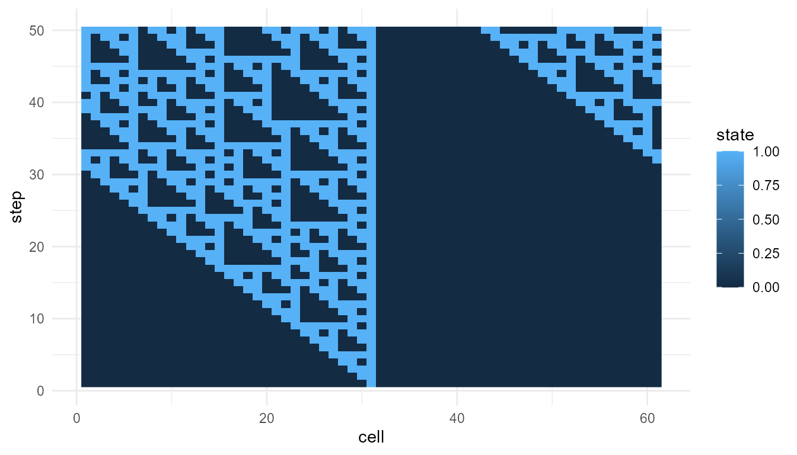
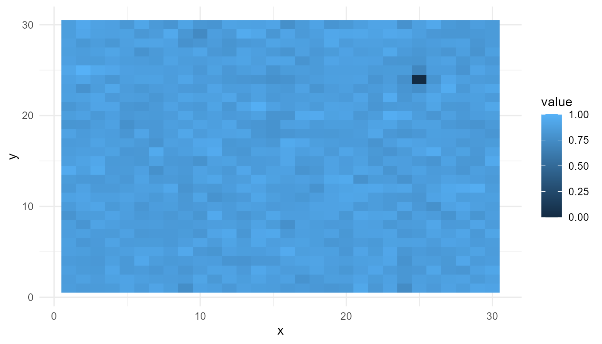
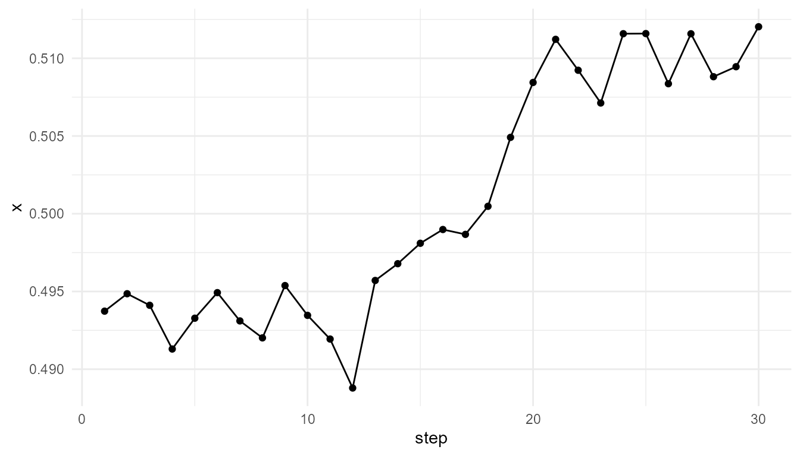

# Comparing Emergence Models Tutorial

``` r
library(emergenceModelR)
```

## Purpose

This tutorial compares several emergence models included in
`emergenceModelR`. The goal is to understand how different local rules
and interaction structures produce different forms of system-level
pattern.

This is a practical tutorial. It focuses on how to run the models,
inspect their outputs, compare summary metrics, and interpret results
carefully.

The package includes several pathways to emergence:

| Model type | Main mechanism | Core function |
|----|----|----|
| Cellular automata | Local update rules | [`simulate_cellular_automata()`](https://noushinn.github.io/emergenceModelR/reference/simulate_cellular_automata.md) |
| Self-organization | Feedback and diffusion | [`simulate_self_organization()`](https://noushinn.github.io/emergenceModelR/reference/simulate_self_organization.md) |
| Agent interactions | Local movement and alignment | [`simulate_agent_interactions()`](https://noushinn.github.io/emergenceModelR/reference/simulate_agent_interactions.md) |
| Network growth | Attachment and connectivity | [`simulate_network_growth()`](https://noushinn.github.io/emergenceModelR/reference/simulate_network_growth.md) |

These models are not meant to represent the same system. They represent
different ways that system-level structure can arise from local
dynamics.

## Learning goals

By the end of this tutorial, you should be able to:

- run one example from each model family;
- inspect the output structure of each model;
- visualize selected outputs;
- compare emergence-oriented summary metrics;
- compare parameter settings within the same model family;
- explain why cross-model comparisons require caution;
- choose an appropriate model for a specific teaching or research
  question.

## Why compare emergence models?

Emergence is not a single mechanism. A cellular automaton, a
self-organizing grid, an agent-based system, and a growing network can
all produce emergent patterns, but they do so in different ways.

Comparing models helps clarify:

- what the basic units are;
- what rules the units follow;
- how interactions occur;
- what kind of global pattern appears;
- what kind of output the model produces;
- how the output should be interpreted.

This is useful because the word *emergence* can become vague if
different mechanisms are not distinguished.

## A comparison workflow

A good comparison workflow is:

1.  Run each model.
2.  Inspect the output structure.
3.  Visualize the main pattern.
4.  Compute simple summary metrics.
5.  Compare models conceptually.
6.  Compare parameters within the same model family.
7.  Interpret results cautiously.

This tutorial follows that workflow.

## Run several models

First, run one example from each major model family.

``` r
ca <- simulate_cellular_automata(
  rule = 110,
  n_cells = 61,
  steps = 50
)

so <- simulate_self_organization(
  grid_size = 30,
  steps = 30,
  diffusion = 0.20,
  feedback = 0.60,
  seed = 5
)

agents <- simulate_agent_interactions(
  n_agents = 50,
  steps = 30,
  interaction_radius = 0.15,
  alignment = 0.05,
  seed = 5
)

network <- simulate_network_growth(
  n_nodes = 60,
  m = 2,
  mode = "preferential",
  seed = 5
)
```

## Inspect the outputs

Each model produces a different kind of output.

``` r
head(ca)
#>   step cell state
#> 1    1    1     0
#> 2    1    2     0
#> 3    1    3     0
#> 4    1    4     0
#> 5    1    5     0
#> 6    1    6     0
head(so)
#>   step x y     value
#> 1    1 1 1 0.2002145
#> 2    1 2 1 0.6852186
#> 3    1 3 1 0.9168758
#> 4    1 4 1 0.2843995
#> 5    1 5 1 0.1046501
#> 6    1 6 1 0.7010575
head(agents)
#>   step agent         x         y
#> 1    1    A1 0.2002145 0.3845769
#> 2    1    A2 0.6852186 0.5662727
#> 3    1    A3 0.9168758 0.9219906
#> 4    1    A4 0.2843995 0.9758776
#> 5    1    A5 0.1046501 0.9330338
#> 6    1    A6 0.7010575 0.3811627
head(network$degree_history)
#>   step node degree
#> 1    3   N1      2
#> 2    3   N2      2
#> 3    3   N3      2
#> 4    4   N1      3
#> 5    4   N2      3
#> 6    4   N3      2
```

This is important. The models should not be compared as if they all
produce the same type of object.

| Model              | Output structure             | Main value column |
|--------------------|------------------------------|-------------------|
| Cellular automata  | Cell states across time      | `state`           |
| Self-organization  | Grid values across time      | `value`           |
| Agent interactions | Agent positions across time  | `x`, `y`          |
| Network growth     | Degree history and edge list | `degree`          |

The value column matters because
[`measure_emergence()`](https://noushinn.github.io/emergenceModelR/reference/measure_emergence.md)
summarizes a selected variable. If the selected variable means different
things in different models, the metrics must be interpreted differently.

## Visualize cellular automata

Cellular automata show how simple local update rules can generate global
space-time patterns.

``` r
plot_emergence_sim(
  ca,
  x = "cell",
  y = "step",
  value = "state",
  type = "raster"
)
```



## Interpret the cellular automaton

In this model, each cell updates based on a local rule. No cell knows
the global pattern. The system-level structure appears through repeated
local updating.

This model emphasizes:

- local rules;
- deterministic updating;
- space-time pattern formation;
- complexity from simple components.

## Visualize self-organization

For the self-organization model, examine the final spatial pattern.

``` r
so_final <- subset(
  so,
  step == max(step)
)

plot_emergence_sim(
  so_final,
  x = "x",
  y = "y",
  value = "value",
  type = "raster"
)
```



## Interpret the self-organization model

This model emphasizes feedback and diffusion. Feedback can amplify local
differences, while diffusion spreads or smooths variation.

The emergent pattern is spatial. It is not generated by a central
designer. It appears through repeated local updating across the grid.

This model emphasizes:

- spatial organization;
- local feedback;
- diffusion;
- pattern formation.

## Visualize agent interactions

For the agent model, one useful summary is the group center over time.

``` r
center <- aggregate(
  cbind(x, y) ~ step,
  data = agents,
  FUN = mean
)

head(center)
#>   step         x         y
#> 1    1 0.4937344 0.5431391
#> 2    2 0.4948551 0.5415049
#> 3    3 0.4941114 0.5441503
#> 4    4 0.4912985 0.5419583
#> 5    5 0.4932812 0.5446167
#> 6    6 0.4949252 0.5441528
```

``` r
plot_emergence_sim(
  center,
  x = "step",
  y = "x",
  type = "line"
)
```



## Interpret the agent model

The agent model emphasizes local interaction among moving individuals.
Each agent follows simple rules, but the group can show collective
behavior.

This model emphasizes:

- individual agents;
- local neighborhoods;
- movement;
- alignment;
- group-level dynamics.

The group center is only one summary. It does not capture all collective
behavior, but it gives a simple way to observe group-level movement.

## Inspect network growth

For the network model, a simple summary is the final degree
distribution.

``` r
network_final <- subset(
  network$degree_history,
  step == max(step)
)

summary(network_final$degree)
#>    Min. 1st Qu.  Median    Mean 3rd Qu.    Max. 
#>     2.0     2.0     3.0     3.9     5.0    15.0
```

``` r
data.frame(
  mean_degree = mean(network_final$degree),
  max_degree = max(network_final$degree),
  sd_degree = stats::sd(network_final$degree)
)
#>   mean_degree max_degree sd_degree
#> 1         3.9         15  2.778245
```

## Interpret the network model

The network model emphasizes relational structure. Nodes connect to
other nodes according to an attachment rule. In a preferential
attachment model, already well-connected nodes are more likely to
receive new links.

This model emphasizes:

- connectivity;
- network growth;
- hubs;
- degree distributions;
- cumulative advantage.

The degree summary helps identify whether some nodes became much more
connected than others.

## Compare summary metrics

The function
[`measure_emergence()`](https://noushinn.github.io/emergenceModelR/reference/measure_emergence.md)
provides simple metrics that can help compare simulation outputs.

``` r
metric_table <- rbind(
  cellular_automata = measure_emergence(
    ca,
    value_col = "state",
    time_col = "step"
  ),
  self_organization = measure_emergence(
    so,
    value_col = "value",
    time_col = "step"
  ),
  agents_x_position = measure_emergence(
    agents,
    value_col = "x",
    time_col = "step"
  ),
  network_degree = measure_emergence(
    network$degree_history,
    value_col = "degree",
    time_col = "step"
  )
)

metric_table
#>                       n unique_states shannon_entropy mean_value  sd_value
#> cellular_automata  3050             2       0.8047175  0.2459016 0.4306911
#> self_organization 27000         26944      14.7102361  0.8430290 0.1394870
#> agents_x_position  1500          1492      10.5344759  0.5006656 0.2850442
#> network_degree     1827            14       2.5637001  3.8095238 2.5560223
#>                   temporal_variability mean_absolute_change
#> cellular_automata          0.136154022          0.044161927
#> self_organization          0.095414407          0.023122286
#> agents_x_position          0.007826525          0.002248112
#> network_degree             0.359005647          0.033333333
```

## Interpreting the metrics

The metrics help summarize variation, diversity, or change. They are
useful for comparison, but they should not be treated as complete
definitions of emergence.

For example:

- high diversity may indicate many different states;
- high temporal change may indicate dynamic behavior;
- high variability may indicate uneven structure;
- low variability may indicate stable or uniform behavior.

However, the meaning of each metric depends on the model. Entropy in a
cellular automaton is not the same as variation in agent positions or
degree variation in a network.

A careful interpretation is:

> These metrics summarize selected features of each model output.

An overstatement would be:

> These metrics show which model is truly more emergent.

The first statement is appropriate. The second is too strong.

## Compare mechanisms, not just numbers

A common mistake is to compare emergence models only by numerical
scores. The more important comparison is conceptual.

| Model              | Unit      | Local rule             | Emergent pattern    |
|--------------------|-----------|------------------------|---------------------|
| Cellular automata  | Cell      | Update from neighbors  | Space-time pattern  |
| Self-organization  | Grid cell | Feedback and diffusion | Spatial structure   |
| Agent interactions | Agent     | Movement and alignment | Collective dynamics |
| Network growth     | Node      | Attachment rule        | Network topology    |

This table shows that each model represents a different pathway to
emergence.

## Within-model comparison: cellular automata rules

Metrics are most useful when comparing outputs from the same model
family. The following example compares two cellular automaton rules.

``` r
ca_30 <- simulate_cellular_automata(
  rule = 30,
  n_cells = 61,
  steps = 50
)

ca_110 <- simulate_cellular_automata(
  rule = 110,
  n_cells = 61,
  steps = 50
)

rbind(
  rule_30 = measure_emergence(
    ca_30,
    value_col = "state",
    time_col = "step"
  ),
  rule_110 = measure_emergence(
    ca_110,
    value_col = "state",
    time_col = "step"
  )
)
#>             n unique_states shannon_entropy mean_value  sd_value
#> rule_30  3050             2       0.9461644  0.3642623 0.4813016
#> rule_110 3050             2       0.8047175  0.2459016 0.4306911
#>          temporal_variability mean_absolute_change
#> rule_30             0.1695683           0.07059217
#> rule_110            0.1361540           0.04416193
```

## Interpretation of cellular automata comparison

The two cellular automata use the same structure but different local
rules. Any differences in the output are due to the rule, not to the
number of cells or steps.

This illustrates a major lesson of emergence:

> The rules of interaction matter as much as the components themselves.

## Within-model comparison: self-organization parameters

Self-organization can be compared by changing feedback or diffusion
while holding other settings constant.

``` r
low_feedback <- simulate_self_organization(
  grid_size = 30,
  steps = 30,
  diffusion = 0.20,
  feedback = 0.20,
  seed = 5
)

high_feedback <- simulate_self_organization(
  grid_size = 30,
  steps = 30,
  diffusion = 0.20,
  feedback = 0.80,
  seed = 5
)

rbind(
  low_feedback = measure_emergence(
    low_feedback,
    value_col = "value",
    time_col = "step"
  ),
  high_feedback = measure_emergence(
    high_feedback,
    value_col = "value",
    time_col = "step"
  )
)
#>                   n unique_states shannon_entropy mean_value  sd_value
#> low_feedback  27000         26944        14.71024  0.7523837 0.1625534
#> high_feedback 27000         26944        14.71024  0.8547248 0.1340823
#>               temporal_variability mean_absolute_change
#> low_feedback            0.09333925           0.01853491
#> high_feedback           0.09204514           0.02424459
```

## Interpretation of self-organization comparison

Changing feedback changes how strongly local values reinforce
themselves. This can affect spatial structure and variation.

This comparison is easier to interpret than comparing self-organization
directly with a network model, because both outputs come from the same
model family.

## Within-model comparison: agent alignment

Agent-based emergence can be compared by changing the strength of
alignment.

``` r
weak_alignment <- simulate_agent_interactions(
  n_agents = 50,
  steps = 30,
  interaction_radius = 0.15,
  alignment = 0.01,
  seed = 5
)

strong_alignment <- simulate_agent_interactions(
  n_agents = 50,
  steps = 30,
  interaction_radius = 0.15,
  alignment = 0.15,
  seed = 5
)

rbind(
  weak_alignment_x = measure_emergence(
    weak_alignment,
    value_col = "x",
    time_col = "step"
  ),
  strong_alignment_x = measure_emergence(
    strong_alignment,
    value_col = "x",
    time_col = "step"
  )
)
#>                       n unique_states shannon_entropy mean_value  sd_value
#> weak_alignment_x   1500          1477        10.48906  0.5006179 0.2892659
#> strong_alignment_x 1500          1500        10.55075  0.5030666 0.2712113
#>                    temporal_variability mean_absolute_change
#> weak_alignment_x            0.007466979          0.002267973
#> strong_alignment_x          0.008823747          0.002285213
```

## Interpretation of agent comparison

Alignment changes how strongly nearby agents influence one another. A
stronger alignment setting may produce more coordinated movement, but
the metrics should be interpreted together with plots or group-level
summaries.

For agent models, a single coordinate such as `x` is only one
perspective on collective behavior.

## Within-model comparison: random and preferential networks

Network emergence can be compared by changing the attachment rule.

``` r
pref_net <- simulate_network_growth(
  n_nodes = 60,
  m = 2,
  mode = "preferential",
  seed = 10
)

rand_net <- simulate_network_growth(
  n_nodes = 60,
  m = 2,
  mode = "random",
  seed = 10
)

pref_final <- subset(
  pref_net$degree_history,
  step == max(step)
)

rand_final <- subset(
  rand_net$degree_history,
  step == max(step)
)

data.frame(
  model = c("preferential", "random"),
  mean_degree = c(mean(pref_final$degree), mean(rand_final$degree)),
  max_degree = c(max(pref_final$degree), max(rand_final$degree)),
  sd_degree = c(stats::sd(pref_final$degree), stats::sd(rand_final$degree))
)
#>          model mean_degree max_degree sd_degree
#> 1 preferential         3.9         17  3.128329
#> 2       random         3.9         11  2.160508
```

## Interpretation of network comparison

Preferential attachment may produce hubs because already well-connected
nodes are more likely to receive new links. Random attachment usually
produces a more even distribution of connections.

This demonstrates that global network structure can emerge from local
attachment rules.

## Cross-model comparison

After comparing within model families, you can compare across model
families more cautiously.

``` r
cross_model_summary <- data.frame(
  model = c(
    "cellular automata",
    "self-organization",
    "agent interactions",
    "network growth"
  ),
  unit = c(
    "cell",
    "grid cell",
    "agent",
    "node"
  ),
  main_rule = c(
    "local state update",
    "feedback and diffusion",
    "movement and alignment",
    "attachment rule"
  ),
  main_pattern = c(
    "space-time pattern",
    "spatial structure",
    "collective movement",
    "network topology"
  )
)

cross_model_summary
#>                model      unit              main_rule        main_pattern
#> 1  cellular automata      cell     local state update  space-time pattern
#> 2  self-organization grid cell feedback and diffusion   spatial structure
#> 3 agent interactions     agent movement and alignment collective movement
#> 4     network growth      node        attachment rule    network topology
```

## Interpretation of cross-model comparison

Cross-model comparison is mostly conceptual. It helps show that
emergence can occur through different mechanisms.

The models should not be ranked as simply “more emergent” or “less
emergent.” Instead, they should be used to ask:

- What is the unit of the model?
- What rule does each unit follow?
- What interactions occur?
- What global pattern appears?
- What does the output leave out?

## Choosing the right model

Different emergence questions require different models.

| Research or teaching question | Useful model |
|----|----|
| How can local rules create patterns? | Cellular automata |
| How can feedback and diffusion create spatial order? | Self-organization |
| How can individual behavior create collective dynamics? | Agent interactions |
| How can local attachment create hubs? | Network growth |
| How can outcomes be summarized? | Emergence metrics |

The best model depends on the question being asked.

## What all models have in common

Despite their differences, the models share a common structure:

1.  Define simple components.
2.  Define local rules.
3.  Let the system evolve.
4.  Observe system-level patterns.
5.  Compare outcomes across parameter settings.
6.  Interpret results cautiously.

This is the basic workflow of emergence modeling.

## What the models leave out

The models are intentionally simplified. They do not include full
physics, chemistry, biology, cognition, or society. They are toy models
for education.

They leave out:

- detailed mechanisms;
- real-world calibration;
- empirical validation;
- multi-scale feedback;
- adaptation in detail;
- environmental complexity;
- subjective experience.

Their purpose is conceptual clarity.

## Responsible interpretation

It is better to say:

> These models illustrate different mechanisms of emergence.

than:

> These models fully explain emergence in nature.

It is better to say:

> The metrics help summarize model behavior.

than:

> The metrics measure emergence completely.

Careful interpretation keeps the package academically credible.

## Suggested exercises

Try the following extensions:

- Compare Rule 30, Rule 90, and Rule 110.
- Compare low and high diffusion in the self-organization model.
- Compare weak and strong alignment in the agent model.
- Compare random and preferential network growth.
- Use
  [`measure_emergence()`](https://noushinn.github.io/emergenceModelR/reference/measure_emergence.md)
  after each comparison.
- Ask whether the metrics match what you see in the plots.

These exercises help turn the tutorial into an active learning tool.

## Key takeaway

Different emergence models highlight different mechanisms. Cellular
automata emphasize local rules. Self-organization emphasizes feedback
and diffusion. Agent models emphasize local interaction. Network models
emphasize growth and attachment.

`emergenceModelR` is useful because it places these models in one
educational framework. This allows learners to compare how different
local dynamics generate different forms of system-level pattern.

The most important lesson is not that one model is “more emergent” than
another. The lesson is that different local mechanisms can produce
different kinds of system-level organization.
