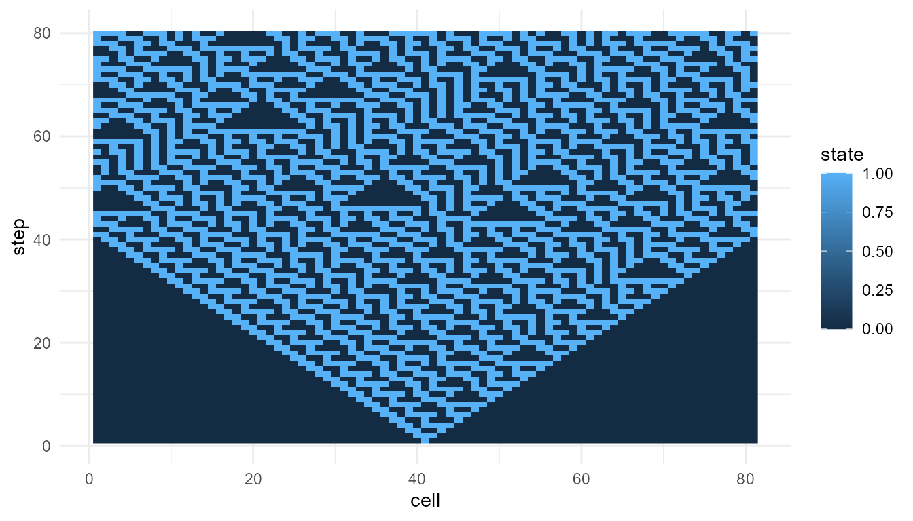

# Complexity and Information

``` r
library(emergenceModelR)
```

## Purpose

This article explains how information and complexity relate to
emergence. Many emergent systems are neither perfectly ordered nor
completely random. They show structured variability: enough order to
form patterns, and enough diversity to remain flexible (Mitchell 2009;
Gell-Mann 1994; Cover and Thomas 2006).

The goal of this chapter is to clarify how information-based ideas can
help describe emergent patterns without reducing emergence to a single
number.

The guiding question is:

> How can information and complexity help us describe patterns that are
> organized but not completely predictable?

## Why information matters for emergence

Emergence is often associated with patterns that arise from interactions
among parts. To describe these patterns, we often need to ask questions
such as:

- How many different states appear?
- How variable is the system?
- How predictable is the pattern?
- How much does the system change over time?
- Is the pattern ordered, random, or somewhere in between?

Information theory provides tools for thinking about uncertainty,
diversity, and signal structure (Shannon 1948; Cover and Thomas 2006).
These tools do not solve the problem of emergence, but they help
describe some features of emergent patterns.

In `emergenceModelR`, information-inspired metrics are used as
educational summaries. They help learners compare model outputs, but
they should not be treated as complete measures of emergence.

## Information as uncertainty reduction

In information theory, information is closely related to uncertainty. A
message is informative when it reduces uncertainty about possible
outcomes.

Shannon entropy is one common way to describe uncertainty or diversity
in a distribution (Shannon 1948). If a system has many possible states
that occur with similar frequency, entropy may be high. If a system is
dominated by one state, entropy may be low.

In educational simulations, entropy can help describe how varied the
system states are.

For example, in a cellular automaton:

- low entropy may indicate that most cells have the same state;
- higher entropy may indicate a more even mixture of states;
- changing entropy may suggest that the system is becoming more or less
  varied over time.

However, entropy must be interpreted carefully.

## Entropy is not meaning

A common misunderstanding is to treat entropy as meaning, intelligence,
organization, or emergence itself. This is not correct.

Entropy measures uncertainty or diversity. It does not automatically
measure meaningful structure.

A purely random pattern can have high entropy but little organization. A
highly ordered pattern can have low entropy but may still be meaningful
in a specific context. A complex emergent pattern may fall between these
extremes.

This distinction is important:

| Pattern type | Possible entropy | Interpretation |
|----|----|----|
| Uniform order | Low entropy | Simple, stable, predictable |
| Pure randomness | High entropy | Diverse but unstructured |
| Structured complexity | Intermediate or context-dependent entropy | Patterned but not trivial |

Emergence often involves structured organization, not just maximum
uncertainty.

## Complexity as balance

Complexity is often associated with systems that balance stability and
change. Systems that are completely frozen may be too simple. Systems
that are completely random may be too disordered. Many interesting
complex systems appear between these extremes.

Langton described computation as occurring near the “edge of chaos,”
where systems are neither frozen nor fully random (Langton 1990). This
idea remains influential in artificial life and complexity studies.

The phrase should be used carefully. It is not a universal law that all
complexity occurs at a precise boundary. However, it captures an
important intuition:

> Complex systems often combine order and variability.

They have enough regularity to maintain structure, but enough
flexibility to generate change.

## Information, complexity, and emergence

Information, complexity, and emergence are related, but they are not
identical.

| Concept     | Main question                                               |
|-------------|-------------------------------------------------------------|
| Information | How uncertain, diverse, or informative are the states?      |
| Complexity  | How structured, variable, and organized is the system?      |
| Emergence   | How do system-level patterns arise from local interactions? |

Information metrics can help describe emergent patterns, but emergence
also requires a multi-level explanation. We need to know what the
components are, how they interact, and what higher-level pattern
appears.

A high entropy value alone does not show emergence. A visible pattern
alone does not fully explain emergence. A strong interpretation connects
metrics, visualization, and model structure.

## Relation to the package

`emergenceModelR` includes
[`measure_emergence()`](https://noushinn.github.io/emergenceModelR/reference/measure_emergence.md)
to provide simple summaries of simulation outputs.

The function can summarize variables such as:

- cell states in cellular automata;
- grid values in self-organization models;
- agent positions in agent-based models;
- node degrees in network growth models.

These summaries can help compare model runs.

| Model | Possible value column | Possible interpretation |
|----|----|----|
| Cellular automata | `state` | Diversity and change in binary cell states |
| Self-organization | `value` | Variation in spatial grid values |
| Agent interactions | `x` or `y` | Variation in agent position |
| Network growth | `degree` | Variation in node connectivity |

The same metric may mean different things in different models. This is
why interpretation must be model-specific.

## Measuring a cellular automaton

The following example measures a cellular automaton pattern.

``` r
ca <- simulate_cellular_automata(
  rule = 110,
  n_cells = 81,
  steps = 80
)

measure_emergence(
  ca,
  value_col = "state",
  time_col = "step"
)
#>      n unique_states shannon_entropy mean_value  sd_value temporal_variability
#> 1 6480             2       0.8660753   0.287963 0.4528487            0.1618021
#>   mean_absolute_change
#> 1           0.03469292
```

## Visualizing the pattern

Metrics are easier to interpret when combined with visualization.

``` r
plot_emergence_sim(
  ca,
  x = "cell",
  y = "step",
  value = "state",
  type = "raster"
)
```


## Interpretation

The plot shows the space-time pattern produced by the cellular
automaton. The metrics summarize selected features of that pattern, such
as diversity or change in cell states.

A careful interpretation is:

> The metrics help describe variation in the simulated cellular
> automaton.

An overstatement would be:

> The metrics fully measure emergence.

The first statement is appropriate. The second is not.

## Comparing two rules

Information-inspired metrics are especially useful when comparing
outputs from the same model family.

``` r
rule_30 <- simulate_cellular_automata(
  rule = 30,
  n_cells = 81,
  steps = 80
)

rule_110 <- simulate_cellular_automata(
  rule = 110,
  n_cells = 81,
  steps = 80
)

rbind(
  rule_30 = measure_emergence(
    rule_30,
    value_col = "state",
    time_col = "step"
  ),
  rule_110 = measure_emergence(
    rule_110,
    value_col = "state",
    time_col = "step"
  )
)
#>             n unique_states shannon_entropy mean_value  sd_value
#> rule_30  6480             2       0.9612044  0.3845679 0.4865305
#> rule_110 6480             2       0.8660753  0.2879630 0.4528487
#>          temporal_variability mean_absolute_change
#> rule_30             0.1640558           0.07110486
#> rule_110            0.1618021           0.03469292
```

## Interpretation of rule comparison

Both simulations use the same model structure. The main difference is
the local update rule. This makes the comparison more meaningful than
comparing unrelated models.

If the metrics differ, the difference may reflect how different local
rules produce different patterns. However, metrics should still be
interpreted together with plots.

``` r
plot_emergence_sim(
  rule_30,
  x = "cell",
  y = "step",
  value = "state",
  type = "raster"
)
```



## Order and randomness

A useful way to think about complexity is to compare three broad
possibilities:

1.  **Too much order**: the system is stable but simple.
2.  **Too much randomness**: the system is variable but unstructured.
3.  **Structured complexity**: the system contains pattern, variation,
    and organization.

Emergent systems often become interesting when they show structured
complexity. They are not merely uniform, but they are also not
meaningless noise.

This is why information measures must be interpreted carefully. High
entropy may indicate diversity, but it does not guarantee organization.
Low entropy may indicate order, but it does not guarantee interesting
structure.

## Measuring self-organization

A self-organization model produces grid values over time. Here, the
value column is `value`.

``` r
so <- simulate_self_organization(
  grid_size = 30,
  steps = 40,
  diffusion = 0.20,
  feedback = 0.60,
  seed = 3
)

measure_emergence(
  so,
  value_col = "value",
  time_col = "step"
)
#>       n unique_states shannon_entropy mean_value  sd_value temporal_variability
#> 1 36000         35924        15.12426  0.8556695 0.1160327           0.07711981
#>   mean_absolute_change
#> 1           0.02240107
```

## Interpretation of self-organization metrics

In this model, the metrics summarize variation in grid values. This is
different from measuring binary states in a cellular automaton.

A higher number of unique values may partly reflect the fact that the
model produces continuous values. It does not automatically mean that
the self-organization model is “more emergent” than the cellular
automaton.

The meaning of the metric depends on the type of output.

## Information and networks

Information and complexity also matter in networks. A network with all
nodes having similar degree may be structurally different from a network
with hubs.

``` r
net <- simulate_network_growth(
  n_nodes = 60,
  m = 2,
  mode = "preferential",
  seed = 4
)

measure_emergence(
  net$degree_history,
  value_col = "degree",
  time_col = "step"
)
#>      n unique_states shannon_entropy mean_value sd_value temporal_variability
#> 1 1827            11        2.594135   3.809524 2.110283            0.3590056
#>   mean_absolute_change
#> 1           0.03333333
```

## Interpretation of network metrics

For networks, the selected value is `degree`, so the metrics summarize
variation in connectivity.

High variability in degree may indicate the emergence of hubs. However,
this does not mean that the network has more “true emergence” in a
universal sense. It means that the network has a more unequal
connectivity structure.

Again, the metric supports interpretation. It does not replace theory.

## Why no single metric is enough

No single metric can capture all aspects of emergence. Emergence may
involve:

- local rules;
- interactions;
- constraints;
- feedback;
- higher-level patterns;
- novelty;
- persistence;
- function;
- causal organization;
- multi-level explanation.

Entropy captures only one part of this broader picture. Other metrics
capture other parts. But the full interpretation depends on how the
model is constructed and what question is being asked.

## Combining metrics, visualization, and theory

A strong analysis should combine three elements:

| Tool          | Role                                      |
|---------------|-------------------------------------------|
| Metrics       | Summarize selected features of the output |
| Visualization | Shows the form of the pattern             |
| Theory        | Explains why the pattern matters          |

For example, a cellular automaton raster plot may show a structured
pattern. Entropy may summarize the diversity of cell states. Theory
explains how local rules generated the pattern.

All three are needed for a careful interpretation.

## Responsible use of metrics

A metric can summarize a pattern, but it cannot replace theoretical
judgment. A high entropy value may indicate diversity, noise, or
disorder. A low entropy value may indicate order, simplicity, or
stagnation. The meaning depends on the model and question.

It is better to say:

> Entropy summarizes diversity or uncertainty in the selected variable.

than:

> Entropy measures emergence.

It is better to say:

> The metrics help compare simulation outputs.

than:

> The metrics prove which system is more complex.

Careful language makes the package more credible.

## Relation to life and consciousness

Information and complexity are important in discussions of life and
consciousness, but they should be used carefully.

Living systems process energy, maintain boundaries, regulate internal
states, and preserve information across generations. Conscious systems
appear to involve integration, attention, memory, and large-scale
coordination. These topics are related to information and complexity,
but they cannot be reduced to entropy alone.

This means that information metrics can support discussion, but they do
not by themselves explain life or consciousness.

`emergenceModelR` helps learners explore simplified patterns of
organization. It does not claim to measure life, intelligence, or
consciousness.

## Educational use

This chapter can support several classroom or self-study questions:

- What does entropy measure?
- Why is high entropy not the same as emergence?
- Why is perfect order not necessarily complex?
- What does it mean for a system to be between order and randomness?
- How can metrics and plots be used together?
- Why should metrics be interpreted in context?
- What does information theory contribute to emergence studies?

These questions help learners use information concepts carefully.

## Key takeaway

Information and complexity are useful for describing emergent systems,
but they should not be confused with emergence itself.

Entropy can summarize uncertainty or diversity. Complexity often
involves structured variability: a balance between order and change.
Emergence requires a multi-level explanation of how system-level
patterns arise from local interactions.

[`measure_emergence()`](https://noushinn.github.io/emergenceModelR/reference/measure_emergence.md)
provides educational metrics that support interpretation. It does not
provide a final or universal measure of emergence.

## References

Cover, Thomas M., and Joy A. Thomas. 2006. *Elements of Information
Theory*. Wiley.

Gell-Mann, Murray. 1994. *The Quark and the Jaguar*. W. H. Freeman.

Langton, Christopher G. 1990. “Computation at the Edge of Chaos.”
*Physica D* 42 (1–3): 12–37.

Mitchell, Melanie. 2009. *Complexity: A Guided Tour*. Oxford University
Press.

Shannon, Claude E. 1948. “A Mathematical Theory of Communication.” *Bell
System Technical Journal* 27 (3): 379–423.
