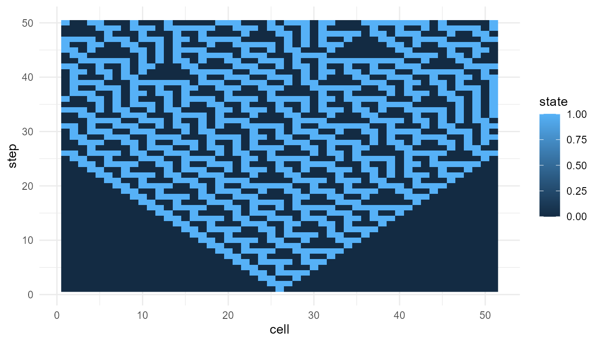
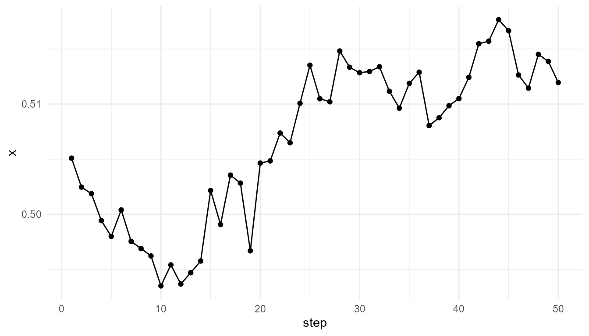

# Getting Started with emergenceModelR

``` r
library(emergenceModelR)
```

## Overview

`emergenceModelR` is an educational R package for exploring emergence,
self-organization, complexity, agent interactions, cellular automata,
and network growth.

The package is designed for teaching, conceptual exploration, science
communication, and portfolio development. It focuses on clarity rather
than realism.

The central idea is:

> System-level patterns can arise from local rules, interactions,
> feedback, and repeated updating.

The simulations in this package are toy models. They do not fully
represent real biological, social, cognitive, or physical systems. Their
purpose is to make the logic of emergence visible and testable.

## What the package helps you explore

`emergenceModelR` includes several families of models:

| Model family | Main question | Core function |
|----|----|----|
| Cellular automata | How can local rules generate global patterns? | [`simulate_cellular_automata()`](https://noushinn.github.io/emergenceModelR/reference/simulate_cellular_automata.md) |
| Self-organization | How can feedback and diffusion create spatial order? | [`simulate_self_organization()`](https://noushinn.github.io/emergenceModelR/reference/simulate_self_organization.md) |
| Agent interactions | How can individual behavior produce collective dynamics? | [`simulate_agent_interactions()`](https://noushinn.github.io/emergenceModelR/reference/simulate_agent_interactions.md) |
| Network growth | How can local attachment rules generate network structure? | [`simulate_network_growth()`](https://noushinn.github.io/emergenceModelR/reference/simulate_network_growth.md) |
| Emergence metrics | How can model outputs be summarized? | [`measure_emergence()`](https://noushinn.github.io/emergenceModelR/reference/measure_emergence.md) |
| Visualization | How can simulation outputs be plotted? | [`plot_emergence_sim()`](https://noushinn.github.io/emergenceModelR/reference/plot_emergence_sim.md) |

## First example: cellular automata

Cellular automata are a clear starting point because they show how
simple local update rules can generate complex global patterns.

In this example, each cell updates based on a local rule. No cell
contains a plan for the whole pattern. The system-level structure
emerges through repeated updating.

``` r
ca <- simulate_cellular_automata(
  rule = 30,
  n_cells = 51,
  steps = 50
)

head(ca)
#>   step cell state
#> 1    1    1     0
#> 2    1    2     0
#> 3    1    3     0
#> 4    1    4     0
#> 5    1    5     0
#> 6    1    6     0
```

## Visualize the pattern

``` r
plot_emergence_sim(
  ca,
  x = "cell",
  y = "step",
  value = "state",
  type = "raster"
)
```



## Interpretation

The plot shows a space-time pattern generated by a local rule. Each row
represents a time step, and each cell state is updated repeatedly.

This example illustrates a core principle of emergence:

> Simple rules can generate organized or complex system-level patterns.

The pattern is not imposed from outside. It arises from the internal
dynamics of the system.

## Measure simple emergence-oriented metrics

The function
[`measure_emergence()`](https://noushinn.github.io/emergenceModelR/reference/measure_emergence.md)
provides simple summary metrics for simulation outputs.

``` r
measure_emergence(
  ca,
  value_col = "state",
  time_col = "step"
)
#>      n unique_states shannon_entropy mean_value  sd_value temporal_variability
#> 1 2550             2       0.9659289  0.3917647 0.4882403             0.167763
#>   mean_absolute_change
#> 1           0.08923569
```

These metrics are useful for comparing model outputs, but they should be
interpreted carefully. They do not fully define emergence. They provide
educational summaries of diversity, variation, or change.

## Try a second rule

Changing the local rule can change the global pattern.

``` r
ca_110 <- simulate_cellular_automata(
  rule = 110,
  n_cells = 51,
  steps = 50
)

measure_emergence(
  ca_110,
  value_col = "state",
  time_col = "step"
)
#>      n unique_states shannon_entropy mean_value  sd_value temporal_variability
#> 1 2550             2        0.873981  0.2941176 0.4557345            0.1628509
#>   mean_absolute_change
#> 1           0.05282113
```

This is one of the most important lessons of emergence modeling:

> The rules of interaction matter as much as the components themselves.

## A second model: self-organization

Self-organization models show how spatial structure can arise through
feedback and diffusion.

``` r
so <- simulate_self_organization(
  grid_size = 30,
  steps = 40,
  diffusion = 0.20,
  feedback = 0.60,
  seed = 2
)

final_so <- subset(so, step == max(step))

plot_emergence_sim(
  final_so,
  x = "x",
  y = "y",
  value = "value",
  type = "raster"
)
```


## A third model: agent interactions

Agent-based models show how individual behavior can generate collective
dynamics.

``` r
agents <- simulate_agent_interactions(
  n_agents = 50,
  steps = 50,
  interaction_radius = 0.15,
  alignment = 0.05,
  seed = 8
)

center <- aggregate(
  cbind(x, y) ~ step,
  data = agents,
  FUN = mean
)

plot_emergence_sim(
  center,
  x = "step",
  y = "x",
  type = "line"
)
```



## A fourth model: network growth

Network models show how local attachment rules can generate large-scale
connectivity patterns.

``` r
net <- simulate_network_growth(
  n_nodes = 60,
  m = 2,
  mode = "preferential",
  seed = 4
)

final_degrees <- subset(
  net$degree_history,
  step == max(step)
)

summary(final_degrees$degree)
#>    Min. 1st Qu.  Median    Mean 3rd Qu.    Max. 
#>     2.0     2.0     3.0     3.9     5.0    12.0
```

## Suggested learning path

A good way to learn the package is:

1.  Start with
    [`simulate_cellular_automata()`](https://noushinn.github.io/emergenceModelR/reference/simulate_cellular_automata.md)
    to understand local rules and global patterns.
2.  Use
    [`simulate_self_organization()`](https://noushinn.github.io/emergenceModelR/reference/simulate_self_organization.md)
    to explore feedback, diffusion, and spatial order.
3.  Use
    [`simulate_agent_interactions()`](https://noushinn.github.io/emergenceModelR/reference/simulate_agent_interactions.md)
    to explore local behavior and collective dynamics.
4.  Use
    [`simulate_network_growth()`](https://noushinn.github.io/emergenceModelR/reference/simulate_network_growth.md)
    to explore hubs, attachment rules, and network structure.
5.  Use
    [`measure_emergence()`](https://noushinn.github.io/emergenceModelR/reference/measure_emergence.md)
    to compare outputs across models.
6.  Use the Theory Guide articles to connect the code to emergence,
    complexity, life, and consciousness.

## Core tutorials and theory guide

The package website is organized into two complementary sections.

| Section | Purpose |
|----|----|
| Core Tutorials | Step-by-step examples showing how to run the functions |
| Theory Guide | Deeper conceptual chapters explaining emergence and complexity |

The tutorials answer:

> How do I run the model?

The theory guide answers:

> What does the model mean?

Both are important. The package is strongest when the code and theory
are read together.

## Responsible interpretation

The models in `emergenceModelR` are simplified educational simulations.
They should not be interpreted as complete scientific models of real
systems.

It is better to say:

> The simulation illustrates emergence-like pattern formation.

than:

> The simulation fully explains emergence in nature.

The purpose of the package is to help learners understand how local
rules and interactions can generate system-level organization.

## Key takeaway

`emergenceModelR` provides a compact educational toolkit for exploring
emergence. It helps users move from simple rules to visible patterns,
from local interaction to system-level organization, and from code
examples to theoretical interpretation.

## References
