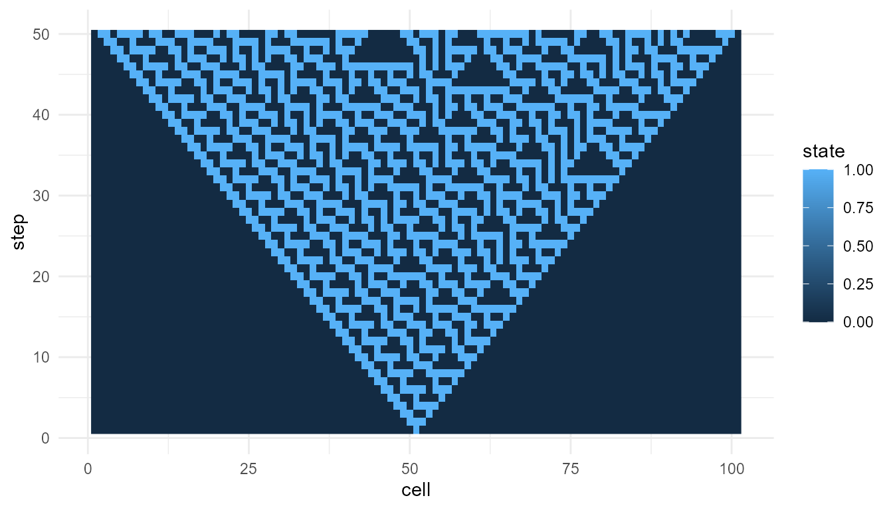
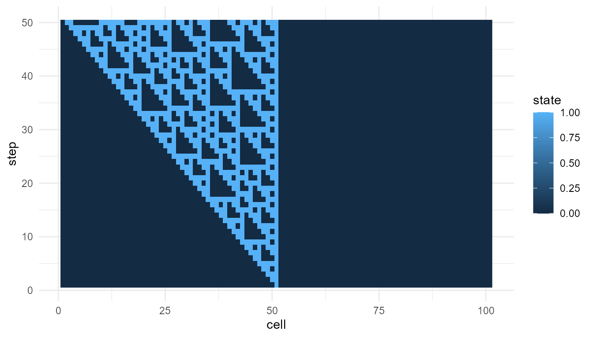

# Measuring Emergence Tutorial

``` r
library(emergenceModelR)
```

## Purpose

This tutorial introduces
[`measure_emergence()`](https://noushinn.github.io/emergenceModelR/reference/measure_emergence.md),
a helper function for summarizing outputs from the simulation functions
in `emergenceModelR`.

Measuring emergence is difficult because emergence is not a single
variable. It may involve diversity, variability, organization, novelty,
temporal change, or multi-level structure.

For this reason,
[`measure_emergence()`](https://noushinn.github.io/emergenceModelR/reference/measure_emergence.md)
should be interpreted as an educational summary tool, not as a universal
emergence score.

In this tutorial, you will learn how to:

- measure a cellular automaton output;
- measure a self-organization output;
- measure agent movement;
- measure network degree history;
- compare metrics across model runs;
- interpret the output responsibly.

## What the function does

[`measure_emergence()`](https://noushinn.github.io/emergenceModelR/reference/measure_emergence.md)
summarizes a selected value column over time.

The two most important arguments are:

| Argument    | Meaning                                       |
|-------------|-----------------------------------------------|
| `value_col` | The column containing the values to summarize |
| `time_col`  | The column representing time steps            |

Depending on the input data, the function may summarize:

- number of observations;
- number of unique values;
- Shannon entropy;
- mean value;
- standard deviation;
- temporal variability;
- mean absolute change over time.

These metrics help describe the simulation output, but they do not fully
define emergence.

## Measure a cellular automaton

Start with a cellular automaton. In this model, the main value column is
`state`.

``` r
ca <- simulate_cellular_automata(
  rule = 30,
  steps = 50
)

head(ca)
#>   step cell state
#> 1    1    1     0
#> 2    1    2     0
#> 3    1    3     0
#> 4    1    4     0
#> 5    1    5     0
#> 6    1    6     0
```

``` r
measure_emergence(
  ca,
  value_col = "state",
  time_col = "step"
)
#>      n unique_states shannon_entropy mean_value  sd_value temporal_variability
#> 1 5050             2       0.8335416  0.2645545 0.4411394            0.1505025
#>   mean_absolute_change
#> 1            0.0585977
```

## Interpretation

For cellular automata, the metrics summarize the distribution and change
of cell states over time.

A careful interpretation is:

> The metrics summarize diversity and temporal change in the cellular
> automaton pattern.

An overstatement would be:

> The metrics fully measure emergence.

The first statement is appropriate. The second is too strong.

## Visualize before interpreting

Metrics are easier to interpret when combined with plots.

``` r
plot_emergence_sim(
  ca,
  x = "cell",
  y = "step",
  value = "state",
  type = "raster"
)
```



The plot shows the space-time pattern. The metrics summarize aspects of
that pattern.

Neither the plot nor the metrics alone gives a complete theory of
emergence. They work best together.

## Compare two cellular automaton rules

Metrics are most useful when comparing similar model outputs.

``` r
ca_30 <- simulate_cellular_automata(
  rule = 30,
  steps = 50
)

ca_110 <- simulate_cellular_automata(
  rule = 110,
  steps = 50
)

rbind(
  rule_30 = measure_emergence(
    ca_30,
    value_col = "state",
    time_col = "step"
  ),
  rule_110 = measure_emergence(
    ca_110,
    value_col = "state",
    time_col = "step"
  )
)
#>             n unique_states shannon_entropy mean_value  sd_value
#> rule_30  5050             2       0.8335416  0.2645545 0.4411394
#> rule_110 5050             2       0.6061112  0.1485149 0.3556448
#>          temporal_variability mean_absolute_change
#> rule_30            0.15050249           0.05859770
#> rule_110           0.08223164           0.02667205
```

## Interpretation of rule comparison

Because both outputs come from the same model family, the comparison is
relatively meaningful.

Any differences in the metrics may reflect how different local rules
generate different global patterns. However, the comparison should still
be supported by visualization.

``` r
plot_emergence_sim(
  ca_110,
  x = "cell",
  y = "step",
  value = "state",
  type = "raster"
)
```



## Measure a self-organizing grid

Now measure a self-organization model. In this model, the main value
column is `value`.

``` r
so <- simulate_self_organization(
  steps = 30,
  seed = 1
)

head(so)
#>   step x y     value
#> 1    1 1 1 0.2655087
#> 2    1 2 1 0.3721239
#> 3    1 3 1 0.5728534
#> 4    1 4 1 0.9082078
#> 5    1 5 1 0.2016819
#> 6    1 6 1 0.8983897
```

``` r
measure_emergence(
  so,
  value_col = "value",
  time_col = "step"
)
#>       n unique_states shannon_entropy mean_value  sd_value temporal_variability
#> 1 27000         26944        14.71024  0.8443567 0.1351917            0.0945904
#>   mean_absolute_change
#> 1           0.02201598
```

## Interpretation

For the self-organization model, the metrics summarize variation and
change in grid values over time.

This is different from the cellular automaton example. The cellular
automaton usually has binary states, while the self-organization model
may produce continuous numeric values.

This means the results should not be compared mechanically. The meaning
of the metric depends on the model.

## Measure agent movement

Agent models produce positions over time. Here, we measure the `x`
position.

``` r
agents <- simulate_agent_interactions(
  steps = 30,
  seed = 1
)

head(agents)
#>   step agent         x          y
#> 1    1    A1 0.2655087 0.47761962
#> 2    1    A2 0.3721239 0.86120948
#> 3    1    A3 0.5728534 0.43809711
#> 4    1    A4 0.9082078 0.24479728
#> 5    1    A5 0.2016819 0.07067905
#> 6    1    A6 0.8983897 0.09946616
```

``` r
measure_emergence(
  agents,
  value_col = "x",
  time_col = "step"
)
#>      n unique_states shannon_entropy mean_value sd_value temporal_variability
#> 1 1500          1484        10.50988  0.5197414 0.271721          0.009654211
#>   mean_absolute_change
#> 1          0.002307986
```

## Interpretation

For agent movement, the metrics summarize variation and change in the
selected position coordinate.

This does not measure the full collective behavior of the agent system.
It only summarizes one selected variable.

A more complete interpretation may also examine:

- `y` position;
- group center over time;
- spread among agents;
- clustering;
- alignment;
- visual trajectories.

## Measure the group center

For agent models, it can be useful to summarize the group center first.

``` r
center <- aggregate(
  cbind(x, y) ~ step,
  data = agents,
  FUN = mean
)

head(center)
#>   step         x         y
#> 1    1 0.5325929 0.5031013
#> 2    2 0.5325314 0.5029745
#> 3    3 0.5332915 0.5030417
#> 4    4 0.5342440 0.5060901
#> 5    5 0.5305963 0.5070438
#> 6    6 0.5286053 0.5078233
```

``` r
measure_emergence(
  center,
  value_col = "x",
  time_col = "step"
)
#>    n unique_states shannon_entropy mean_value    sd_value temporal_variability
#> 1 30            30        4.906891  0.5197414 0.009654211          0.009654211
#>   mean_absolute_change
#> 1          0.002307986
```

This summarizes change in the average group position, rather than change
across all individual positions.

## Measure network degree history

Network models produce degree history. Here, the main value column is
`degree`.

``` r
net <- simulate_network_growth(
  n_nodes = 60,
  m = 2,
  mode = "preferential",
  seed = 4
)

head(net$degree_history)
#>   step node degree
#> 1    3   N1      2
#> 2    3   N2      2
#> 3    3   N3      2
#> 4    4   N1      2
#> 5    4   N2      3
#> 6    4   N3      3
```

``` r
measure_emergence(
  net$degree_history,
  value_col = "degree",
  time_col = "step"
)
#>      n unique_states shannon_entropy mean_value sd_value temporal_variability
#> 1 1827            11        2.594135   3.809524 2.110283            0.3590056
#>   mean_absolute_change
#> 1           0.03333333
```

## Interpretation

For network growth, the metrics summarize variation and change in node
degree over time.

A high standard deviation may indicate unequal connectivity. A high
maximum degree may indicate hub formation.

However, the metric does not prove that one network is “more emergent.”
It only summarizes the degree pattern.

## Compare preferential and random networks

A useful comparison is preferential attachment versus random attachment.

``` r
pref_net <- simulate_network_growth(
  n_nodes = 60,
  m = 2,
  mode = "preferential",
  seed = 4
)

random_net <- simulate_network_growth(
  n_nodes = 60,
  m = 2,
  mode = "random",
  seed = 4
)

rbind(
  preferential = measure_emergence(
    pref_net$degree_history,
    value_col = "degree",
    time_col = "step"
  ),
  random = measure_emergence(
    random_net$degree_history,
    value_col = "degree",
    time_col = "step"
  )
)
#>                 n unique_states shannon_entropy mean_value sd_value
#> preferential 1827            11        2.594135   3.809524 2.110283
#> random       1827            11        2.605490   3.809524 1.972388
#>              temporal_variability mean_absolute_change
#> preferential            0.3590056           0.03333333
#> random                  0.3590056           0.03333333
```

## Interpretation of network comparison

The two networks use the same number of nodes but different attachment
rules.

Preferential attachment may produce more unequal degree distributions
because well-connected nodes have a higher chance of receiving new
links. Random attachment usually produces a different degree pattern.

The metrics help summarize the difference, but the interpretation
depends on the theory of network growth.

## Compare several model families

You can also place several model summaries into one table.

``` r
summary_table <- rbind(
  cellular_automata = measure_emergence(
    ca,
    value_col = "state",
    time_col = "step"
  ),
  self_organization = measure_emergence(
    so,
    value_col = "value",
    time_col = "step"
  ),
  agents_x_position = measure_emergence(
    agents,
    value_col = "x",
    time_col = "step"
  ),
  network_degree = measure_emergence(
    net$degree_history,
    value_col = "degree",
    time_col = "step"
  )
)

summary_table
#>                       n unique_states shannon_entropy mean_value  sd_value
#> cellular_automata  5050             2       0.8335416  0.2645545 0.4411394
#> self_organization 27000         26944      14.7102361  0.8443567 0.1351917
#> agents_x_position  1500          1484      10.5098781  0.5197414 0.2717210
#> network_degree     1827            11       2.5941353  3.8095238 2.1102828
#>                   temporal_variability mean_absolute_change
#> cellular_automata          0.150502494          0.058597697
#> self_organization          0.094590396          0.022015983
#> agents_x_position          0.009654211          0.002307986
#> network_degree             0.359005647          0.033333333
```

## Interpreting cross-model comparisons

This table is useful for orientation, but it should be interpreted
carefully.

Each model uses a different kind of value:

| Model              | Value column | Meaning               |
|--------------------|--------------|-----------------------|
| Cellular automata  | `state`      | Binary cell state     |
| Self-organization  | `value`      | Grid value            |
| Agent interactions | `x`          | Agent position        |
| Network growth     | `degree`     | Number of connections |

Because the value columns mean different things, the metrics do not have
exactly the same interpretation across models.

It is usually better to compare metrics within the same model family
before comparing across model families.

## Good uses of `measure_emergence()`

The function is useful for:

- comparing two cellular automaton rules;
- comparing low and high diffusion settings;
- comparing weak and strong feedback settings;
- comparing agent movement under different alignment settings;
- comparing random and preferential network growth;
- summarizing large simulation outputs;
- supporting visual interpretation.

## Poor uses of `measure_emergence()`

Avoid using the function to claim:

- that emergence has been fully measured;
- that one simulation proves real-world emergence;
- that entropy alone captures complexity;
- that a model creates life or consciousness;
- that a single number can replace interpretation.

The function provides helpful summaries, not final answers.

## Suggested exercises

Try modifying the examples above.

``` r
experiment <- simulate_cellular_automata(
  rule = 90,
  steps = 50
)

measure_emergence(
  experiment,
  value_col = "state",
  time_col = "step"
)
#>      n unique_states shannon_entropy mean_value  sd_value temporal_variability
#> 1 5050             2       0.4111854 0.08257426 0.2752649           0.06675167
#>   mean_absolute_change
#> 1           0.05475854
```

Questions to consider:

- How do the metrics change when you change the cellular automaton rule?
- How do metrics change when diffusion is higher or lower?
- How does network degree variation differ between random and
  preferential attachment?
- Do the metrics match what you see in the plots?
- What does each metric miss?

## Responsible interpretation

It is better to say:

> [`measure_emergence()`](https://noushinn.github.io/emergenceModelR/reference/measure_emergence.md)
> summarizes selected features of a simulation output.

than:

> [`measure_emergence()`](https://noushinn.github.io/emergenceModelR/reference/measure_emergence.md)
> gives the true emergence score.

It is better to say:

> Entropy and variability help compare model runs.

than:

> Entropy and variability fully measure emergence.

Careful interpretation is important because emergence is a theoretical
concept, not a single number.

## Key takeaway

[`measure_emergence()`](https://noushinn.github.io/emergenceModelR/reference/measure_emergence.md)
helps users summarize and compare simulation outputs. It is useful for
describing diversity, variability, and temporal change.

The function should be used as an interpretive aid. It works best when
combined with visualization, model understanding, and careful
theoretical explanation.

## References
