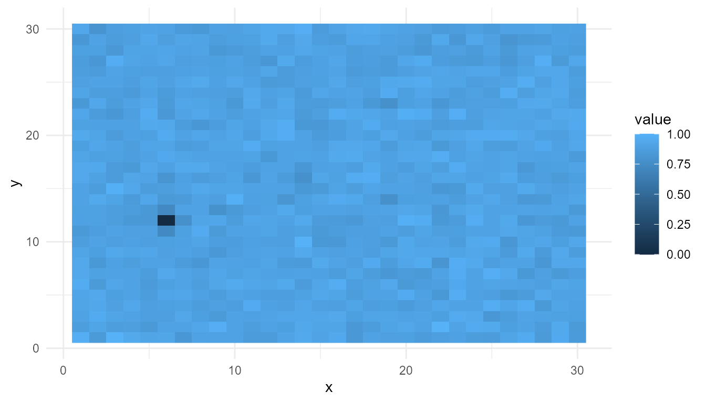
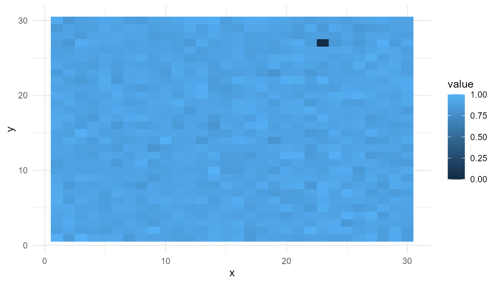
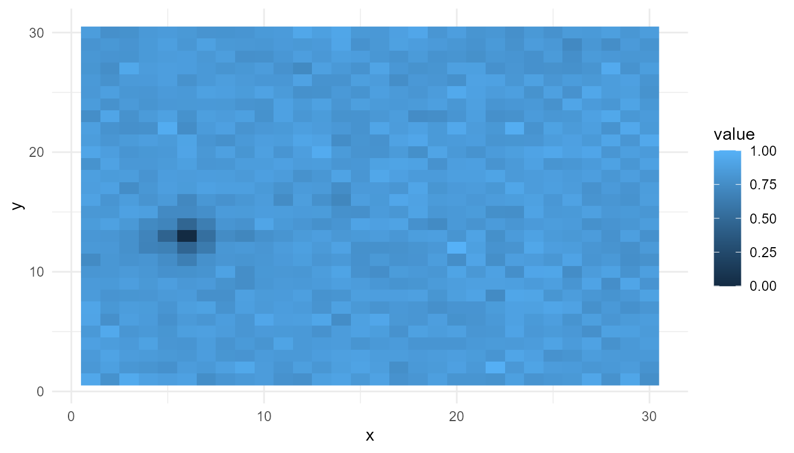
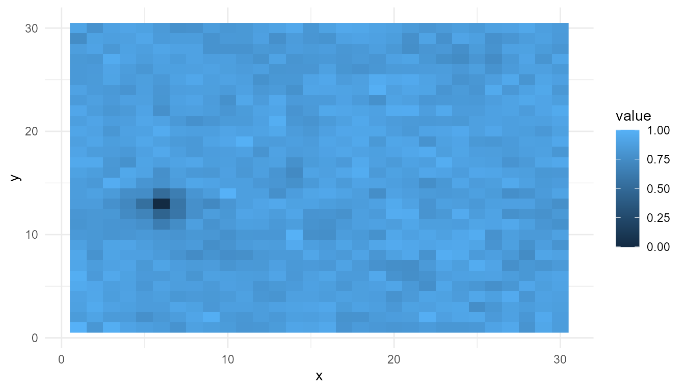
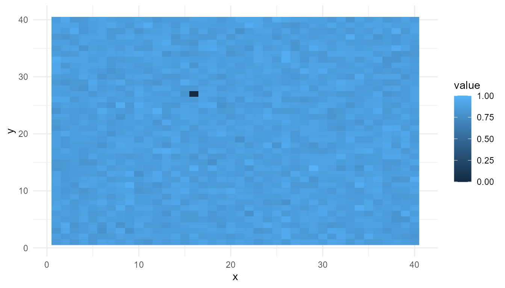

# Self-Organization Tutorial

``` r
library(emergenceModelR)
```

## Purpose

This tutorial introduces
[`simulate_self_organization()`](https://noushinn.github.io/emergenceModelR/reference/simulate_self_organization.md),
which creates a simplified grid-based model of self-organization.

The function is designed to help users explore how local feedback and
diffusion can generate spatial patterns over time.

In this tutorial, you will learn how to:

- run a basic self-organization simulation;
- inspect the output;
- plot the final spatial pattern;
- compare diffusion settings;
- compare feedback settings;
- summarize outputs with
  [`measure_emergence()`](https://noushinn.github.io/emergenceModelR/reference/measure_emergence.md);
- interpret the results responsibly.

## What the function represents

[`simulate_self_organization()`](https://noushinn.github.io/emergenceModelR/reference/simulate_self_organization.md)
creates a grid of values. At each time step, the values are updated
according to simplified feedback and diffusion dynamics.

The model is not a real chemical, ecological, or biological simulation.
It is a teaching model for exploring a general idea:

> Spatial patterns can arise from repeated local updating.

## Main arguments

| Argument    | Meaning                                                |
|-------------|--------------------------------------------------------|
| `grid_size` | Size of the square grid                                |
| `steps`     | Number of time steps to simulate                       |
| `diffusion` | Strength of smoothing or spreading across nearby cells |
| `feedback`  | Strength of local reinforcement                        |
| `seed`      | Random seed for reproducible results                   |

The two most important parameters are `diffusion` and `feedback`.

Diffusion tends to smooth local differences. Feedback tends to amplify
or reinforce local structure. The balance between them affects the final
pattern.

## Basic simulation

Start with a simple simulation.

``` r
so <- simulate_self_organization(
  grid_size = 30,
  steps = 40,
  diffusion = 0.20,
  feedback = 0.60,
  seed = 2
)

head(so)
#>   step x y     value
#> 1    1 1 1 0.1848823
#> 2    1 2 1 0.7023740
#> 3    1 3 1 0.5733263
#> 4    1 4 1 0.1680519
#> 5    1 5 1 0.9438393
#> 6    1 6 1 0.9434750
```

## Inspect the output

The output is a data frame. Each row represents a grid location at a
particular time step.

``` r
str(so)
#> 'data.frame':    36000 obs. of  4 variables:
#>  $ step : int  1 1 1 1 1 1 1 1 1 1 ...
#>  $ x    : int  1 2 3 4 5 6 7 8 9 10 ...
#>  $ y    : int  1 1 1 1 1 1 1 1 1 1 ...
#>  $ value: num  0.185 0.702 0.573 0.168 0.944 ...
```

The main columns usually include:

| Column  | Meaning                               |
|---------|---------------------------------------|
| `step`  | Time step                             |
| `x`     | Horizontal grid position              |
| `y`     | Vertical grid position                |
| `value` | Simulated value at that grid location |

This structure makes it possible to filter by time step and visualize
the grid.

## Plot the final pattern

To visualize the final state of the system, first keep only the last
time step.

``` r
final_step <- subset(
  so,
  step == max(step)
)

head(final_step)
#>       step x y     value
#> 35101   40 1 1 0.9822507
#> 35102   40 2 1 0.8463782
#> 35103   40 3 1 1.0000000
#> 35104   40 4 1 0.9440521
#> 35105   40 5 1 0.9166127
#> 35106   40 6 1 0.9245696
```

Now plot the final spatial pattern.

``` r
plot_emergence_sim(
  final_step,
  x = "x",
  y = "y",
  value = "value",
  type = "raster"
)
```



## Interpretation

The final pattern was not drawn directly. It was generated by repeated
updating across the grid.

This illustrates the basic idea of self-organization:

> Local interactions can produce system-level spatial structure.

The pattern should be interpreted as a simplified educational example,
not as a realistic physical or biological system.

## Compare diffusion settings

Diffusion controls how strongly values spread or smooth across the grid.

A low-diffusion setting may preserve more local variation. A
high-diffusion setting may produce smoother patterns.

``` r
low_diffusion <- simulate_self_organization(
  grid_size = 30,
  steps = 40,
  diffusion = 0.05,
  feedback = 0.60,
  seed = 2
)

low_final <- subset(
  low_diffusion,
  step == max(step)
)

plot_emergence_sim(
  low_final,
  x = "x",
  y = "y",
  value = "value",
  type = "raster"
)
```



``` r
high_diffusion <- simulate_self_organization(
  grid_size = 30,
  steps = 40,
  diffusion = 0.60,
  feedback = 0.60,
  seed = 2
)

high_final <- subset(
  high_diffusion,
  step == max(step)
)

plot_emergence_sim(
  high_final,
  x = "x",
  y = "y",
  value = "value",
  type = "raster"
)
```



## Summarize diffusion comparison

``` r
rbind(
  low_diffusion = measure_emergence(
    low_diffusion,
    value_col = "value",
    time_col = "step"
  ),
  high_diffusion = measure_emergence(
    high_diffusion,
    value_col = "value",
    time_col = "step"
  )
)
#>                    n unique_states shannon_entropy mean_value  sd_value
#> low_diffusion  36000         35924        15.12426  0.8577009 0.1348483
#> high_diffusion 36000         35924        15.12426  0.8287478 0.1165446
#>                temporal_variability mean_absolute_change
#> low_diffusion            0.09046575           0.01611421
#> high_diffusion           0.07510070           0.02297257
```

## Interpretation of diffusion

Diffusion affects how values spread across the grid.

If diffusion is low, local differences may remain more visible. If
diffusion is high, local differences may be smoothed more strongly.

The metrics help summarize the difference, but the plots are also
important. A numerical summary alone cannot fully describe the spatial
pattern.

## Compare feedback settings

Feedback controls how strongly local values reinforce themselves.

A low-feedback setting may produce weaker structure. A high-feedback
setting may amplify local differences more strongly.

``` r
low_feedback <- simulate_self_organization(
  grid_size = 30,
  steps = 40,
  diffusion = 0.20,
  feedback = 0.20,
  seed = 2
)

low_feedback_final <- subset(
  low_feedback,
  step == max(step)
)

plot_emergence_sim(
  low_feedback_final,
  x = "x",
  y = "y",
  value = "value",
  type = "raster"
)
```



``` r
high_feedback <- simulate_self_organization(
  grid_size = 30,
  steps = 40,
  diffusion = 0.20,
  feedback = 0.80,
  seed = 2
)

high_feedback_final <- subset(
  high_feedback,
  step == max(step)
)

plot_emergence_sim(
  high_feedback_final,
  x = "x",
  y = "y",
  value = "value",
  type = "raster"
)
```


## Summarize feedback comparison

``` r
rbind(
  low_feedback = measure_emergence(
    low_feedback,
    value_col = "value",
    time_col = "step"
  ),
  high_feedback = measure_emergence(
    high_feedback,
    value_col = "value",
    time_col = "step"
  )
)
#>                   n unique_states shannon_entropy mean_value  sd_value
#> low_feedback  36000         35924        15.12426  0.7778680 0.1582942
#> high_feedback 36000         35924        15.12426  0.8646283 0.1200662
#>               temporal_variability mean_absolute_change
#> low_feedback            0.09867767           0.01629656
#> high_feedback           0.08042580           0.02038872
```

## Interpretation of feedback

Feedback can amplify local structure. When feedback is stronger, small
differences may become more pronounced.

However, stronger feedback does not automatically mean “more emergence.”
It only means that the model dynamics have changed. The result must be
interpreted using both the visualization and the summary metrics.

## Compare all runs

It can be useful to place several model runs in one summary table.

``` r
summary_table <- rbind(
  baseline = measure_emergence(
    so,
    value_col = "value",
    time_col = "step"
  ),
  low_diffusion = measure_emergence(
    low_diffusion,
    value_col = "value",
    time_col = "step"
  ),
  high_diffusion = measure_emergence(
    high_diffusion,
    value_col = "value",
    time_col = "step"
  ),
  low_feedback = measure_emergence(
    low_feedback,
    value_col = "value",
    time_col = "step"
  ),
  high_feedback = measure_emergence(
    high_feedback,
    value_col = "value",
    time_col = "step"
  )
)

summary_table
#>                    n unique_states shannon_entropy mean_value  sd_value
#> baseline       36000         35924        15.12426  0.8518298 0.1264448
#> low_diffusion  36000         35924        15.12426  0.8577009 0.1348483
#> high_diffusion 36000         35924        15.12426  0.8287478 0.1165446
#> low_feedback   36000         35924        15.12426  0.7778680 0.1582942
#> high_feedback  36000         35924        15.12426  0.8646283 0.1200662
#>                temporal_variability mean_absolute_change
#> baseline                 0.08424196           0.01843044
#> low_diffusion            0.09046575           0.01611421
#> high_diffusion           0.07510070           0.02297257
#> low_feedback             0.09867767           0.01629656
#> high_feedback            0.08042580           0.02038872
```

## Suggested exercises

Try changing the parameters and observing the results.

``` r
experiment <- simulate_self_organization(
  grid_size = 40,
  steps = 60,
  diffusion = 0.15,
  feedback = 0.75,
  seed = 10
)

experiment_final <- subset(
  experiment,
  step == max(step)
)

plot_emergence_sim(
  experiment_final,
  x = "x",
  y = "y",
  value = "value",
  type = "raster"
)
```



Questions to consider:

- What happens when diffusion is very low?
- What happens when diffusion is very high?
- What happens when feedback is very low?
- What happens when feedback is very high?
- Which settings produce the clearest spatial structure?
- Do the metrics match what you see in the plots?

## Responsible interpretation

This model is intentionally simplified. It should be described as an
educational abstraction of self-organization-like pattern formation.

It is better to say:

> The simulation illustrates how feedback and diffusion can shape
> spatial patterns.

than:

> The simulation proves how real biological self-organization works.

The model helps explain a concept. It does not replace detailed
scientific models.

## Key takeaway

[`simulate_self_organization()`](https://noushinn.github.io/emergenceModelR/reference/simulate_self_organization.md)
helps users explore how local feedback and diffusion can produce spatial
patterns over time.

The most important lesson is that system-level structure can arise from
repeated local updating. By changing diffusion and feedback, learners
can observe how different parameter settings affect the resulting
pattern.
