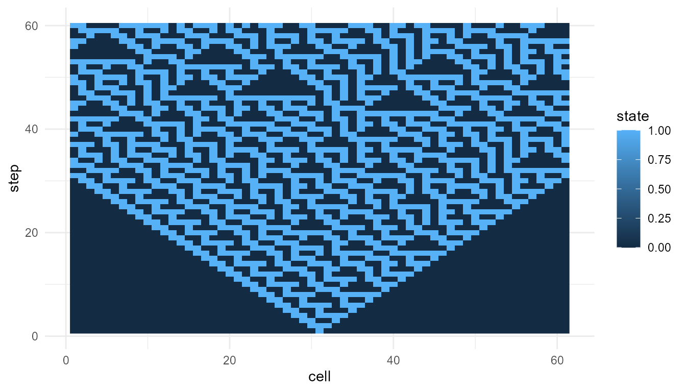

# What Is Emergence?

``` r
library(emergenceModelR)
```

## Purpose

This article introduces the conceptual foundation of `emergenceModelR`.
Emergence refers to situations in which system-level patterns arise from
interactions among lower-level parts. The central idea is that the whole
may display forms of organization that are not obvious from the
properties of isolated components (Anderson 1972; Holland 1998; Mitchell
2009).

The package does not attempt to provide a final definition of emergence.
Instead, it offers simplified simulations that help learners examine how
local rules, feedback, interaction, adaptation, and network structure
can generate global patterns.

The guiding question is:

> How can simple local interactions produce organized patterns at the
> level of the whole system?

## Emergence as a multi-level concept

Emergence is a multi-level concept. It involves at least two levels of
description:

1.  a lower level of components, rules, and interactions;
2.  a higher level of collective pattern, organization, or behavior.

For example, a single bird does not contain a flocking pattern. A single
cell in a cellular automaton does not contain the full spatial structure
produced by the rule. A single node in a network does not contain the
topology of the entire network. The emergent pattern belongs to the
organized system, not to any isolated part.

This does not mean that emergence is mysterious or supernatural. It
means that explanation requires attention to relationships,
interactions, feedback, and system structure. The system-level pattern
depends on how parts are connected and how they influence one another
over time.

## Emergence, complexity, and self-organization

Emergence is closely related to complexity and self-organization, but
these terms should not be treated as identical.

**Complexity** often refers to systems with many interacting parts,
nonlinear relationships, feedback loops, and patterns that are difficult
to predict from individual components alone (Mitchell 2009).

**Self-organization** refers to the spontaneous formation of order or
structure without centralized control. A system self-organizes when
local interactions produce coherent global patterns.

**Emergence** refers to the appearance of higher-level properties or
patterns arising from lower-level interactions.

These concepts often overlap. A complex system may self-organize, and
self-organization may produce emergent patterns. However, the terms
emphasize different aspects of the system.

| Concept | Main emphasis | Example |
|----|----|----|
| Complexity | Many interacting parts and nonlinear dynamics | ecosystems, economies, neural systems |
| Self-organization | Order without central control | flocking, pattern formation, clustering |
| Emergence | System-level properties arising from local interactions | cellular automata patterns, network hubs, collective behavior |

`emergenceModelR` includes functions that illustrate all three ideas.

## Local rules and global patterns

A central lesson of emergence is that local rules can generate global
patterns. The lower-level parts do not need to know the global outcome.
They only follow local interaction rules.

This is important because many natural and social systems appear
organized without being centrally designed. Examples include ant
colonies, traffic patterns, neural activity, markets, ecosystems, and
developmental processes.

In emergence studies, the question is not only:

> What are the parts?

but also:

> How do the parts interact?

A system composed of the same components can behave very differently if
the interaction rules change. This is why simulation is useful. It
allows learners to manipulate rules and observe how system-level
outcomes change.

## Weak and strong emergence

A useful distinction is between **weak emergence** and **strong
emergence**.

Weak emergence refers to patterns that arise from lower-level rules but
may be difficult to predict without running the system. The pattern is
generated by the rules, but it may still be surprising, complex, or
analytically difficult to derive in advance (Holland 1998;
**bedau1997weak?**).

Strong emergence refers to the stronger philosophical claim that
higher-level properties have causal powers that are not reducible to
lower-level dynamics. This claim is more controversial and is often
discussed in philosophy of mind, metaphysics, and debates about
consciousness.

`emergenceModelR` focuses on weak emergence. The package shows how
surprising global patterns can arise from simple rules. It does not make
strong metaphysical claims about irreducible higher-level causation.

This distinction is especially important because emergence is sometimes
used too loosely. In this package, emergence means:

> system-level pattern formation from local rules and interactions.

It does not mean magic, mystery, or unexplained causation.

## Why simulation matters

Emergence is often easier to understand through simulation than through
verbal description alone. A verbal explanation can say that local rules
generate global patterns. A simulation shows this process unfolding step
by step.

Simulation is useful because it makes theoretical assumptions explicit.
A model must specify:

- what the components are;
- what rules they follow;
- how they interact;
- how the system changes over time;
- what output counts as a system-level pattern.

This makes simulation a powerful educational tool. It allows learners to
experiment with different rules, parameters, and initial conditions,
then observe how the global behavior changes.

## Relation to the package

`emergenceModelR` is organized around several types of emergence models.

| Function | Conceptual role |
|----|----|
| [`simulate_cellular_automata()`](https://noushinn.github.io/emergenceModelR/reference/simulate_cellular_automata.md) | Shows how simple local update rules create global spatial and temporal patterns |
| [`simulate_self_organization()`](https://noushinn.github.io/emergenceModelR/reference/simulate_self_organization.md) | Models pattern formation through local feedback, diffusion, and reinforcement |
| [`simulate_agent_interactions()`](https://noushinn.github.io/emergenceModelR/reference/simulate_agent_interactions.md) | Shows how local agent behavior can produce collective dynamics |
| [`simulate_network_growth()`](https://noushinn.github.io/emergenceModelR/reference/simulate_network_growth.md) | Shows how local attachment rules shape global network structure |
| [`measure_emergence()`](https://noushinn.github.io/emergenceModelR/reference/measure_emergence.md) | Provides simple metrics for diversity, entropy, and temporal change |
| [`plot_emergence_sim()`](https://noushinn.github.io/emergenceModelR/reference/plot_emergence_sim.md) | Visualizes emergent patterns and simulation outputs |

Each function focuses on a different pathway from local interaction to
system-level pattern.

## Conceptual map of the package

The package can be understood as a small educational framework:

| Level | Question | Package example |
|----|----|----|
| Components | What are the basic units? | cells, agents, nodes |
| Rules | How do units behave? | update rules, movement rules, attachment rules |
| Interactions | How do units influence one another? | neighborhoods, feedback, links |
| Dynamics | How does the system change over time? | iterations, steps, growth |
| Patterns | What emerges at the system level? | clusters, waves, hubs, diversity, entropy |

This structure helps learners move from isolated parts to collective
organization.

## Minimal example: cellular automata

Cellular automata are classic examples of emergence. A one-dimensional
cellular automaton consists of cells that update their states according
to a local rule. Each cell responds only to its nearby neighbors, yet
the repeated application of the rule can produce complex global
patterns.

``` r
ca <- simulate_cellular_automata(
  rule = 30,
  n_cells = 61,
  steps = 60
)

plot_emergence_sim(
  ca,
  x = "cell",
  y = "step",
  value = "state",
  type = "raster"
)
```



## Interpretation

The pattern is generated by a local rule applied repeatedly. No cell
contains the full pattern. No central controller designs the structure.
The global form emerges from many local updates over time.

This example illustrates a core idea in emergence studies: simple rules
can generate patterns that are difficult to anticipate by looking only
at the rule itself. The system must be allowed to unfold.

Rule 30 is especially useful pedagogically because it shows how a
deterministic local rule can produce visually complex behavior. The
complexity is not added from outside. It arises through iteration.

## Comparing rules

Different local rules can produce very different global patterns. This
makes cellular automata useful for teaching the sensitivity of emergent
systems to rule structure.

``` r
ca_90 <- simulate_cellular_automata(
  rule = 90,
  n_cells = 61,
  steps = 60
)

ca_110 <- simulate_cellular_automata(
  rule = 110,
  n_cells = 61,
  steps = 60
)

head(ca_90)
#>   step cell state
#> 1    1    1     0
#> 2    1    2     0
#> 3    1    3     0
#> 4    1    4     0
#> 5    1    5     0
#> 6    1    6     0
head(ca_110)
#>   step cell state
#> 1    1    1     0
#> 2    1    2     0
#> 3    1    3     0
#> 4    1    4     0
#> 5    1    5     0
#> 6    1    6     0
```

Rule changes can produce ordered, repetitive, chaotic, or complex
patterns. This helps show that emergence is not merely randomness.
Emergent patterns often occupy a middle ground between rigid order and
complete disorder.

## Measuring emergent patterns

Visual inspection is useful, but emergence can also be explored through
simple metrics. The function
[`measure_emergence()`](https://noushinn.github.io/emergenceModelR/reference/measure_emergence.md)
provides basic measures that help summarize system behavior.

``` r
measure_emergence(
  ca,
  value_col = "state",
  time_col = "step"
)
#>      n unique_states shannon_entropy mean_value  sd_value temporal_variability
#> 1 3660             2       0.9605494  0.3836066 0.4863303             0.162152
#>   mean_absolute_change
#> 1           0.07224229
```

Metrics do not fully define emergence, but they help make comparison
possible. For example, entropy-like measures can indicate diversity or
unpredictability, while temporal-change measures can indicate how much
the system evolves over time.

These measures should be interpreted as educational summaries, not as
final measures of emergence.

## Emergence and explanation

Emergence changes how we think about explanation. In a purely
reductionist explanation, one might try to explain the whole system only
by listing the properties of the parts. Emergence shows why this is
incomplete.

The parts matter, but so do:

- their arrangement;
- their interactions;
- their feedback loops;
- their history;
- their environment;
- their rules of change.

An emergent explanation therefore connects levels. It does not ignore
the lower level, but it also does not assume that isolated components
are enough.

## Emergence in life and consciousness

Emergence is especially important in discussions of life and
consciousness. Living systems show organization, adaptation, metabolism,
reproduction, and regulation that depend on interactions among many
parts. Conscious systems appear to involve large-scale coordination
among perception, attention, memory, embodiment, and action.

This does not mean that emergence alone explains life or consciousness.
But it provides a useful conceptual bridge. It allows us to ask how
organized wholes can arise from interacting components without assuming
a central controller.

In this sense, `emergenceModelR` complements projects such as
`lifesimulatoR` and `consciousnessModelR`. It provides a broader
modeling framework for thinking about how organized systems arise.

## What the package captures

The package captures several important ideas:

- global patterns can arise from local rules;
- interaction structure matters;
- feedback can amplify small differences;
- simple systems can produce complex outcomes;
- simulation can reveal patterns not obvious from isolated components;
- system-level behavior often requires multi-level explanation.

These ideas make the package useful for teaching emergence across
biology, cognitive science, artificial life, network science, and
complexity studies.

## What the package does not capture

The package is intentionally simplified. It does not provide:

- full physical models;
- full biological models;
- full social-science models;
- full neural models;
- a final theory of emergence;
- proof of strong emergence;
- direct evidence about consciousness.

The simulations are toy models. Their purpose is conceptual clarity, not
complete realism.

## Responsible interpretation

It is better to say:

> The simulation illustrates emergence-like pattern formation from local
> rules.

than:

> The simulation proves emergence in nature.

It is better to say:

> The model helps explore how global structure can arise from local
> interactions.

than:

> The model fully explains life or consciousness.

Careful language matters because emergence can be overused. The goal of
this package is to make the concept clearer, not more vague.

## Key takeaway

Emergence is not simply complexity or randomness. It is a way of
explaining how organized system-level patterns arise from interactions
among parts.

`emergenceModelR` uses toy simulations to make this idea visible,
testable, and teachable. The package focuses on weak emergence: global
patterns generated by local rules, interactions, feedback, and system
dynamics.

## References

Anderson, Philip W. 1972. “More Is Different.” *Science* 177 (4047):
393–96.

Holland, John H. 1998. *Emergence: From Chaos to Order*. Oxford
University Press.

Mitchell, Melanie. 2009. *Complexity: A Guided Tour*. Oxford University
Press.
